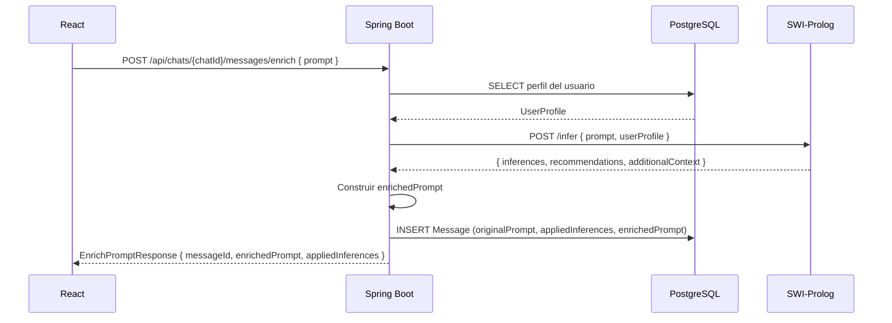
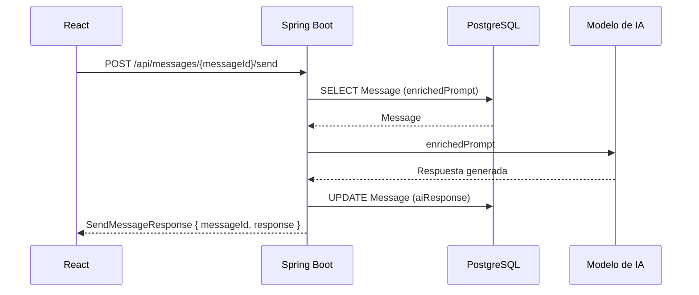
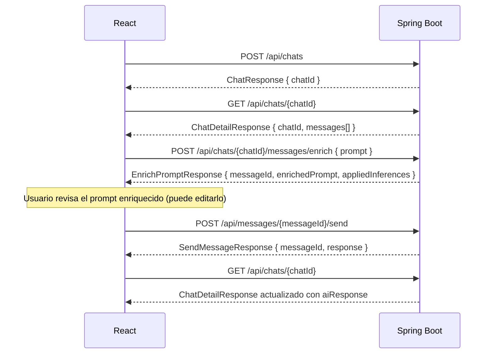

# API Contract — v1

**Proyecto:** Sistema Experto para Personalización Inteligente de Prompts  
**Versión:** 1.0  
**Fecha:** 2026-06-10  
**Estado:** Borrador activo

---

## Índice

1. [Introducción](#1-introducción)
2. [Convenciones](#2-convenciones)
3. [ProfileController](#3-profilecontroller)
4. [ChatController](#4-chatcontroller)
5. [ExpertSystemController](#5-expertsystemcontroller)
6. [AIController](#6-aicontroller)
7. [Modelos de Datos](#7-modelos-de-datos)
8. [Flujos Principales](#8-flujos-principales)
9. [Endpoints Internos de Prolog](#9-endpoints-internos-de-prolog)

---

## 1. Introducción

Este documento define el contrato oficial de la API REST entre el frontend (React) y el backend (Spring Boot) para la versión 1 del sistema.

Su propósito es servir como referencia estable y compartida durante el desarrollo, de modo que ambos equipos puedan trabajar en paralelo con expectativas alineadas sobre estructura de requests, responses y códigos de error.

El sistema permite gestionar perfiles de usuario, enriquecer prompts mediante inferencias realizadas por SWI-Prolog, y opcionalmente enviar esos prompts enriquecidos a un modelo de IA externo.

> **Nota:** Los [Endpoints Internos de Prolog](#9-endpoints-internos-de-prolog) están documentados en la sección 9 pero **no forman parte de este contrato**. Son exclusivamente para comunicación interna entre Spring Boot y el servicio Prolog.

---

## 2. Convenciones

| Convención | Valor |
|---|---|
| **Base URL** | `/api` |
| **Formato** | JSON (`application/json`) |
| **Encoding** | UTF-8 |
| **Fechas** | ISO-8601 — `2026-06-10T14:30:00Z` |
| **Autenticación** | A definir (fuera del alcance v1) |
| **Identificadores** | Enteros (`Long`) en todos los IDs |

### Estructura de errores

Todos los errores siguen la misma estructura:

```json
{
  "status": 404,
  "error": "Not Found",
  "message": "Chat not found with id: 42",
  "timestamp": "2026-06-10T14:30:00Z"
}
```

---

## 3. ProfileController

### `GET /api/profile`

Obtener el perfil completo del usuario autenticado, incluyendo sus skills y niveles de conocimiento.

| Campo | Valor |
|---|---|
| **Método** | `GET` |
| **URL** | `/api/profile` |
| **Path params** | — |
| **Query params** | — |
| **Request body** | — |

**Response body** `200 OK`

```json
{
  "userId": 1,
  "name": "Lautaro",
  "email": "lautaro@example.com",
  "educationLevel": "UNIVERSITY_STUDENT",
  "studyYear": 3,
  "worksInIT": true,
  "skills": [
    {
      "skillId": 3,
      "name": "Docker",
      "level": 2
    },
    {
      "skillId": 7,
      "name": "Java",
      "level": 8
    }
  ],
  "createdAt": "2026-01-15T10:00:00Z"
}
```

**Códigos HTTP**

| Código | Descripción |
|---|---|
| `200` | Perfil obtenido correctamente |
| `404` | Perfil no encontrado |

---

### `PUT /api/profile/skills/{skillId}`

Actualizar el nivel de conocimiento del usuario para una skill específica.

| Campo | Valor |
|---|---|
| **Método** | `PUT` |
| **URL** | `/api/profile/skills/{skillId}` |
| **Path params** | `skillId` — ID de la skill a actualizar |
| **Query params** | — |

**Request body**

```json
{
  "level": 5
}
```

> **Valores válidos para `level`:** entero entre `1` y `10` (inclusive).  
> Interpretación orientativa: 1–3 básico · 4–7 intermedio · 8–10 avanzado.  
> La categorización es responsabilidad del sistema experto y no se almacena.

**Response body** `200 OK`

```json
{
  "skillId": 3,
  "name": "Docker",
  "level": 5
}
```

**Códigos HTTP**

| Código | Descripción |
|---|---|
| `200` | Nivel actualizado correctamente |
| `400` | Valor de `level` fuera del rango 1–10 |
| `404` | Skill no encontrada |

---

### `GET /api/skills`

Obtener el catálogo completo de skills disponibles en el sistema.

| Campo | Valor |
|---|---|
| **Método** | `GET` |
| **URL** | `/api/skills` |
| **Path params** | — |
| **Query params** | `category` (opcional) — filtrar por categoría |

**Response body** `200 OK`

```json
[
  {
    "skillId": 1,
    "name": "Java",
    "category": "backend"
  },
  {
    "skillId": 2,
    "name": "React",
    "category": "frontend"
  },
  {
    "skillId": 3,
    "name": "Docker",
    "category": "devops"
  }
]
```

**Códigos HTTP**

| Código | Descripción |
|---|---|
| `200` | Catálogo obtenido correctamente |

---

## 4. ChatController

### `POST /api/chats`

Crear un nuevo chat para el usuario.

| Campo | Valor |
|---|---|
| **Método** | `POST` |
| **URL** | `/api/chats` |
| **Path params** | — |
| **Query params** | — |

**Request body**

```json
{
  "title": "Aprendiendo Docker"
}
```

**Response body** `201 Created`

```json
{
  "chatId": 12,
  "title": "Aprendiendo Docker",
  "messageCount": 0,
  "createdAt": "2026-06-10T14:00:00Z",
  "updatedAt": "2026-06-10T14:00:00Z"
}
```

**Códigos HTTP**

| Código | Descripción |
|---|---|
| `201` | Chat creado correctamente |
| `400` | Request inválido |

---

### `GET /api/chats`

Listar todos los chats del usuario ordenados por fecha de última actividad descendente.

| Campo | Valor |
|---|---|
| **Método** | `GET` |
| **URL** | `/api/chats` |
| **Path params** | — |
| **Query params** | — |

**Response body** `200 OK`

```json
[
  {
    "chatId": 12,
    "title": "Aprendiendo Docker",
    "messageCount": 4,
    "createdAt": "2026-06-10T14:00:00Z",
    "updatedAt": "2026-06-10T15:30:00Z"
  },
  {
    "chatId": 8,
    "title": "Spring Boot con JPA",
    "messageCount": 7,
    "createdAt": "2026-06-08T09:00:00Z",
    "updatedAt": "2026-06-09T11:00:00Z"
  }
]
```

**Códigos HTTP**

| Código | Descripción |
|---|---|
| `200` | Lista obtenida correctamente |

---

### `GET /api/chats/{chatId}`

Obtener un chat completo con todos sus mensajes.

| Campo | Valor |
|---|---|
| **Método** | `GET` |
| **URL** | `/api/chats/{chatId}` |
| **Path params** | `chatId` — ID del chat |
| **Query params** | — |

**Response body** `200 OK`

```json
{
  "chatId": 12,
  "title": "Aprendiendo Docker",
  "createdAt": "2026-06-10T14:00:00Z",
  "updatedAt": "2026-06-10T15:30:00Z",
  "messages": [
    {
      "messageId": 15,
      "originalPrompt": "Explícame Docker",
      "enrichedPrompt": "Eres un desarrollador Java con nivel principiante en Docker...",
      "appliedInferences": ["backend_developer", "needs_docker", "use_java_examples"],
      "aiResponse": "Docker es una plataforma de contenedores que...",
      "createdAt": "2026-06-10T14:05:00Z"
    }
  ]
}
```

**Códigos HTTP**

| Código | Descripción |
|---|---|
| `200` | Chat obtenido correctamente |
| `404` | Chat no encontrado |

---

### `PATCH /api/chats/{chatId}`

Renombrar un chat existente.

| Campo | Valor |
|---|---|
| **Método** | `PATCH` |
| **URL** | `/api/chats/{chatId}` |
| **Path params** | `chatId` — ID del chat |

**Request body**

```json
{
  "title": "Docker para backend developers"
}
```

**Response body** `200 OK`

```json
{
  "chatId": 12,
  "title": "Docker para backend developers",
  "updatedAt": "2026-06-10T16:00:00Z"
}
```

**Códigos HTTP**

| Código | Descripción |
|---|---|
| `200` | Chat renombrado correctamente |
| `400` | Request inválido |
| `404` | Chat no encontrado |

---

### `DELETE /api/chats/{chatId}`

Eliminar un chat y todos sus mensajes asociados.

| Campo | Valor |
|---|---|
| **Método** | `DELETE` |
| **URL** | `/api/chats/{chatId}` |
| **Path params** | `chatId` — ID del chat |

**Response body** — vacío

**Códigos HTTP**

| Código | Descripción |
|---|---|
| `204` | Chat eliminado correctamente |
| `404` | Chat no encontrado |

> **Nota:** La eliminación es permanente e incluye todos los mensajes del chat.

---

## 5. ExpertSystemController

### `POST /api/chats/{chatId}/messages/enrich`

**Caso de uso principal del sistema.** Recibe el prompt original del usuario, consulta su perfil en PostgreSQL, ejecuta las inferencias en Prolog y devuelve el prompt enriquecido junto con las inferencias aplicadas. En esta etapa **no se consulta ningún modelo de IA**.

| Campo | Valor |
|---|---|
| **Método** | `POST` |
| **URL** | `/api/chats/{chatId}/messages/enrich` |
| **Path params** | `chatId` — ID del chat al que pertenecerá el mensaje |

**Request body**

```json
{
  "prompt": "Explícame Docker"
}
```

**Response body** `201 Created`

```json
{
  "messageId": 15,
  "chatId": 12,
  "originalPrompt": "Explícame Docker",
  "appliedInferences": [
    "backend_developer",
    "needs_docker",
    "use_java_examples"
  ],
  "enrichedPrompt": "El usuario es estudiante universitario de tercer año que trabaja en IT y tiene nivel avanzado en Java (8/10) pero nivel inicial en Docker (2/10). Explícame Docker desde una perspectiva de backend Java, usando Maven y el ecosistema JVM como punto de referencia.",
  "aiResponse": null,
  "createdAt": "2026-06-10T14:05:00Z"
}
```

**Códigos HTTP**

| Código | Descripción |
|---|---|
| `201` | Prompt enriquecido generado y mensaje persistido |
| `400` | Prompt vacío o request inválido |
| `404` | Chat no encontrado |
| `503` | Servicio Prolog no disponible |

> **Notas importantes:**
> - El mensaje se persiste en la base de datos con `aiResponse: null`.
> - El `messageId` devuelto es el que debe usarse para llamar a `POST /api/messages/{messageId}/send` si el usuario decide enviar el prompt a la IA.
> - El estado completo y actualizado del mensaje siempre puede obtenerse mediante `GET /api/chats/{chatId}`, que devuelve la conversación completa con todos sus mensajes.
> - El frontend debe mostrar el pipeline de progreso durante esta llamada (ver ADR-008).

---

## 6. AIController

### `POST /api/messages/{messageId}/send`

Enviar el prompt enriquecido de un mensaje existente al modelo de IA configurado. La respuesta se persiste en el mensaje y se devuelve al frontend.

| Campo | Valor |
|---|---|
| **Método** | `POST` |
| **URL** | `/api/messages/{messageId}/send` |
| **Path params** | `messageId` — ID del mensaje a enviar |
| **Request body** | — |

**Response body** `200 OK`

```json
{
  "messageId": 15,
  "response": "Docker es una plataforma de contenedores que permite empaquetar aplicaciones junto con sus dependencias en unidades aisladas llamadas contenedores. Pensándolo desde Java: es similar a tener un JAR ejecutable, pero que incluye también el JDK, el sistema operativo y todas las dependencias del sistema..."
}
```

**Códigos HTTP**

| Código | Descripción |
|---|---|
| `200` | Respuesta recibida y persistida correctamente |
| `404` | Mensaje no encontrado |
| `409` | El mensaje ya tiene una respuesta de IA (usar `/retry`) |
| `503` | Servicio de IA no disponible |

> **Nota:** Solo puede llamarse a este endpoint si el mensaje ya tiene un `enrichedPrompt`. Si `enrichedPrompt` es null, el backend responderá con `400`.

---

### `POST /api/messages/{messageId}/retry`

Reintentar la generación de la respuesta de IA para un mensaje que ya fue enviado anteriormente. Sobrescribe la respuesta anterior.

| Campo | Valor |
|---|---|
| **Método** | `POST` |
| **URL** | `/api/messages/{messageId}/retry` |
| **Path params** | `messageId` — ID del mensaje |
| **Request body** | — |

**Response body** `200 OK`

```json
{
  "messageId": 15,
  "response": "Docker es una plataforma de contenedores..."
}
```

**Códigos HTTP**

| Código | Descripción |
|---|---|
| `200` | Nueva respuesta generada y persistida correctamente |
| `404` | Mensaje no encontrado |
| `503` | Servicio de IA no disponible |

---

## 7. Modelos de Datos

### `ProfileResponse`

```json
{
  "userId": 1,
  "name": "string",
  "email": "string",
  "educationLevel": "SECONDARY_STUDENT | TERTIARY_STUDENT | UNIVERSITY_STUDENT | GRADUATED | POSTGRADUATE",
  "studyYear": "integer | null",
  "worksInIT": "boolean",
  "skills": ["SkillResponse"],
  "createdAt": "ISO-8601"
}
```

> **`studyYear`** solo aplica cuando `educationLevel` es `SECONDARY_STUDENT`, `TERTIARY_STUDENT` o `UNIVERSITY_STUDENT`. En cualquier otro caso debe ser `null`.

---

### `SkillResponse`

```json
{
  "skillId": 1,
  "name": "string",
  "level": "integer (1–10)"
}
```

> El campo `category` se omite de las respuestas del perfil. Está disponible únicamente en el catálogo (`GET /api/skills`) donde no lleva `level`, ya que el nivel es siempre relativo al usuario.

---

### `UpdateSkillLevelRequest`

```json
{
  "level": "integer (1–10)"
}
```

---

### `ChatResponse`

```json
{
  "chatId": 1,
  "title": "string",
  "messageCount": 0,
  "createdAt": "ISO-8601",
  "updatedAt": "ISO-8601"
}
```

---

### `ChatDetailResponse`

Extiende `ChatResponse` incluyendo el listado de mensajes.

```json
{
  "chatId": 1,
  "title": "string",
  "createdAt": "ISO-8601",
  "updatedAt": "ISO-8601",
  "messages": ["MessageResponse"]
}
```

---

### `CreateChatRequest`

```json
{
  "title": "string"
}
```

---

### `RenameChatRequest`

```json
{
  "title": "string"
}
```

---

### `MessageResponse`

```json
{
  "messageId": 1,
  "chatId": 1,
  "originalPrompt": "string",
  "appliedInferences": ["string"],
  "enrichedPrompt": "string",
  "aiResponse": "string | null",
  "createdAt": "ISO-8601"
}
```

---

### `EnrichPromptRequest`

```json
{
  "prompt": "string"
}
```

---

### `EnrichPromptResponse`

```json
{
  "messageId": 1,
  "chatId": 1,
  "originalPrompt": "string",
  "appliedInferences": ["string"],
  "enrichedPrompt": "string",
  "aiResponse": null,
  "createdAt": "ISO-8601"
}
```

---

### `SendMessageResponse`

```json
{
  "messageId": 1,
  "response": "string"
}
```

---

### `ErrorResponse`

```json
{
  "status": 0,
  "error": "string",
  "message": "string",
  "timestamp": "ISO-8601"
}
```

---

## 8. Flujos Principales

### Flujo de enriquecimiento



> El frontend debe mostrar el progreso de cada etapa al usuario durante esta llamada (ver ADR-008).

---

### Flujo de envío a IA



---

### Flujo completo de una conversación



---

## 9. Endpoints Internos de Prolog

> ⚠️ **Esta sección documenta la interfaz interna entre Spring Boot y el servicio SWI-Prolog.**  
> Estos endpoints **no forman parte del contrato con el frontend** y el cliente React nunca debe llamarlos directamente.  
> Se documentan aquí únicamente como referencia para el equipo de backend.

---

### `POST /infer`

Ejecutar las reglas de inferencia del sistema experto sobre el perfil del usuario y el prompt recibido.

**Consumidor:** Spring Boot (exclusivamente)  
**Proveedor:** Servicio SWI-Prolog

**Request body**

```json
{
  "prompt": "Explícame Docker",
  "userProfile": {
    "educationLevel": "UNIVERSITY_STUDENT",
    "studyYear": 3,
    "worksInIT": true,
    "skills": [
      {
        "name": "Java",
        "level": 8
      },
      {
        "name": "Docker",
        "level": 2
      }
    ]
  }
}
```

**Response body** `200 OK`

```json
{
  "inferences": [
    "backend_developer",
    "needs_docker",
    "use_java_examples"
  ],
  "recommendations": [
    "Usar analogía con máquinas virtuales",
    "Incluir ejemplo con docker run",
    "Contextualizar desde el ecosistema Java"
  ],
  "additionalContext": "Nivel principiante confirmado. Usuario familiarizado con Maven, se puede referenciar como analogía de gestión de dependencias."
}
```

**Códigos HTTP**

| Código | Descripción |
|---|---|
| `200` | Inferencias generadas correctamente |
| `400` | Request malformado |
| `500` | Error interno en el motor de inferencia |

> **Notas:**
> - Spring Boot es el único cliente autorizado de este endpoint.
> - Prolog no accede a PostgreSQL. Todos los datos del perfil deben ser provistos por Spring Boot en el request (ver ADR-006).
> - La comunicación ocurre dentro de la red interna de Docker Compose mediante el nombre del servicio.

---

*Documento generado el 2026-06-10. Para modificaciones, coordinar con ambos equipos (frontend y backend) antes de aplicar cambios que afecten el contrato.*
