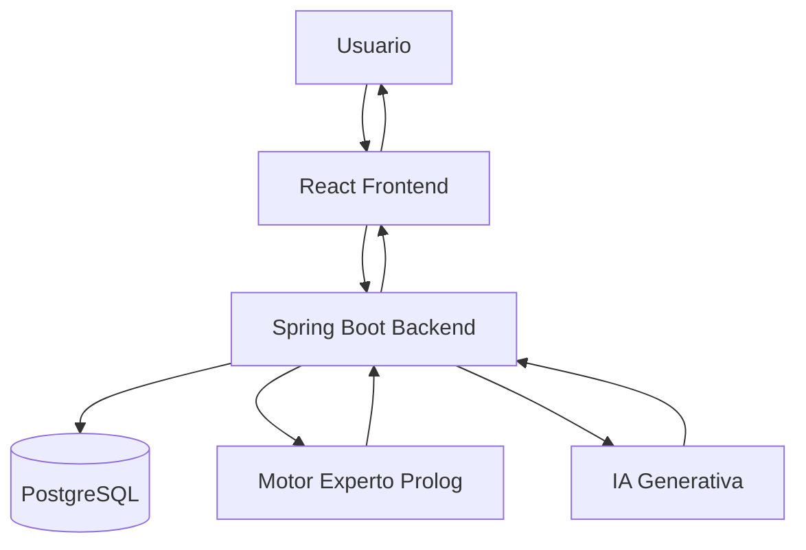
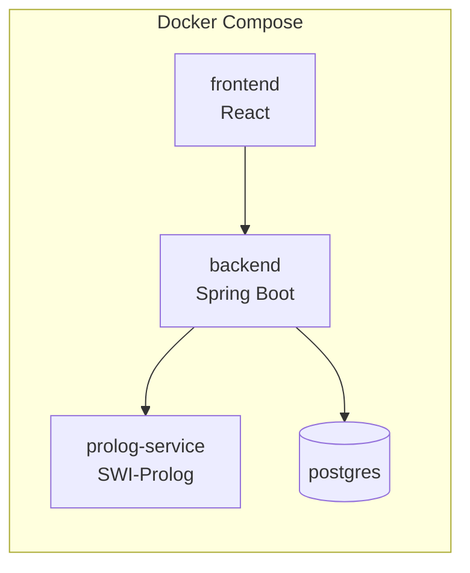
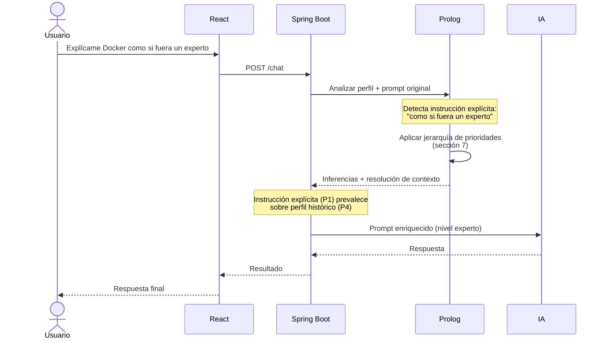
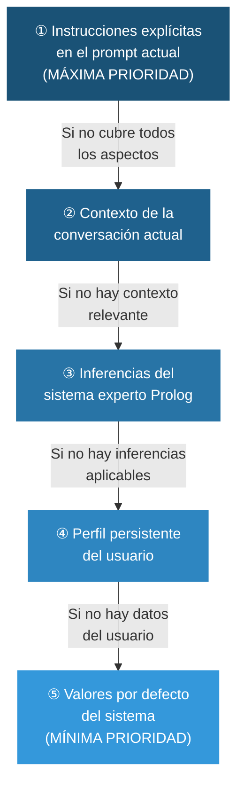

# Sistema Experto para Personalización Inteligente de Prompts mediante IA y Prolog

## Trabajo Final - Conceptos y Paradigmas de Programación

### Integrantes
- Lautaro Salvo Schafer
- Gerardo Loza

---

# 1. Introducción

## Problema

Las herramientas de Inteligencia Artificial generativa suelen recibir prompts incompletos o ambiguos.

Ejemplos:

```text
Explícame Docker
```

```text
Ayudame con Programación Concurrente
```

```text
Quiero aprender Machine Learning
```

La calidad de la respuesta depende enormemente de la calidad del prompt.

Actualmente el usuario debe enriquecer manualmente sus consultas agregando contexto, experiencia previa, objetivos y preferencias.

El proyecto busca resolver este problema mediante un Sistema Experto que construya automáticamente contexto personalizado para enriquecer los prompts enviados a una IA.

---

# 2. Objetivo General

Desarrollar un sistema experto capaz de:

- Mantener un perfil dinámico del usuario.
- Inferir conocimientos, intereses y necesidades.
- Personalizar prompts automáticamente, respetando siempre las instrucciones explícitas del usuario.
- Aprender progresivamente sobre el usuario.
- Explicar las decisiones tomadas.
- Integrarse con modelos de IA generativa.

---

# 3. Paradigmas Utilizados

## Paradigma Orientado a Objetos / Imperativo

Tecnología:

- Java
- Spring Boot

Responsabilidades:

- API REST
- Persistencia
- Gestión de usuarios
- Comunicación entre servicios
- Integración con IA

---

## Paradigma Lógico / Declarativo

Tecnología:

- SWI-Prolog

Responsabilidades:

- Base de conocimiento
- Reglas expertas
- Inferencia
- Deducción de intereses
- Recomendaciones
- Personalización de prompts
- Resolución de prioridades entre fuentes de contexto

---

# 4. Arquitectura General

El sistema combina múltiples fuentes de contexto para construir prompts enriquecidos. La regla central de negocio es que **las instrucciones explícitas del usuario siempre tienen prioridad** sobre cualquier dato inferido o almacenado. El Motor Experto Prolog es responsable de aplicar esta jerarquía durante el proceso de inferencia (ver sección 7).

```text
React Frontend
        |
        v
Spring Boot Backend
        |
        +------> PostgreSQL
        |
        +------> Servicio Prolog
        |
        +------> IA Generativa
```



---

# 5. Arquitectura Docker Compose

Servicios:

1. frontend
2. backend
3. prolog-service
4. postgres

```yaml
services:

  frontend:
    build: ./frontend

  backend:
    build: ./backend

  prolog:
    build: ./prolog

  postgres:
    image: postgres:17
```


---

# 6. Flujo Principal

## Paso 1

Usuario escribe:

```text
Explícame Docker como si fuera un experto
```

## Paso 2

React envía la solicitud al backend.

## Paso 3

Spring obtiene el perfil del usuario desde la base de datos.

## Paso 4

Spring consulta al motor experto Prolog, enviando tanto el perfil como el mensaje original del usuario.

## Paso 5

Prolog analiza el prompt en busca de instrucciones explícitas y realiza inferencias sobre el perfil.

## Paso 6

Prolog aplica la jerarquía de prioridades para resolver conflictos entre fuentes de contexto. Las instrucciones explícitas del prompt tienen máxima prioridad (ver sección 7).

## Paso 7

Spring construye un prompt enriquecido respetando la resolución de prioridades obtenida de Prolog.

## Paso 8

El prompt enriquecido es enviado a una IA.

## Paso 9

La respuesta vuelve al usuario.



---

# 7. Prioridad de Contextos

## Motivación

El sistema combina múltiples fuentes de información para personalizar cada prompt. Estas fuentes pueden entrar en conflicto: el perfil histórico del usuario puede indicar un nivel básico en un tema, mientras que el prompt actual puede pedir explícitamente una explicación de nivel experto.

Sin una jerarquía clara, el sistema podría degradar la respuesta basándose en datos históricos, ignorando la voluntad explícita del usuario. Esta sección define la **regla central de negocio** que governa cómo se resuelven esos conflictos.

## Jerarquía de Fuentes de Contexto

Las fuentes de contexto se aplican en el siguiente orden de prioridad, de mayor a menor:

| Prioridad | Fuente | Descripción |
|-----------|--------|-------------|
| 1 | Instrucciones explícitas en el prompt actual | Lo que el usuario pide directamente en el mensaje presente |
| 2 | Contexto de la conversación actual | Acuerdos, definiciones y ajustes establecidos en el hilo en curso |
| 3 | Inferencias del sistema experto | Deducciones realizadas por el motor Prolog sobre el perfil |
| 4 | Perfil persistente del usuario | Skills, niveles, intereses e historial almacenados en la base de datos |
| 5 | Valores por defecto del sistema | Configuración base cuando no hay información disponible |

## Regla Fundamental

> **Las instrucciones explícitas del usuario SIEMPRE tienen prioridad sobre cualquier dato inferido o almacenado.**

Esto garantiza que el sistema enriquece y potencia los prompts del usuario sin nunca contradecirlos.

## Cómo Interactúan las Fuentes

Cada fuente de contexto aporta información al prompt enriquecido, pero las fuentes de menor prioridad solo actúan cuando las de mayor prioridad no cubren ese aspecto:

- Si el usuario pide explícitamente un nivel de explicación → se usa ese nivel (P1), ignorando el nivel del perfil (P4).
- Si el usuario no especifica el nivel → se consultan las inferencias de Prolog (P3) y el perfil (P4).
- Si no hay información en el perfil → se usan los valores por defecto (P5).

El perfil y las inferencias siempre complementan al prompt, nunca lo restringen.

## Resolución de Conflictos

Cuando una fuente de mayor prioridad especifica algo que contradice a una de menor prioridad, la de mayor prioridad siempre gana. El sistema experto registra esta resolución para incluirla en la explicabilidad (ver sección 17).

### Ejemplo: conflicto entre instrucción explícita y perfil histórico

**Perfil del usuario:**
```json
{
  "skills": [
    { "name": "Docker", "level": 2 }
  ]
}
```

**Prompt del usuario:**
```text
Explícame Docker como si fuera un experto
```

**Resolución:**

| Aspecto | Perfil — P4 | Instrucción explícita — P1 | Resultado |
|---------|-------------|---------------------------|-----------|
| Nivel de explicación | Básico (nivel 2) | Experto | **Experto** ✓ |
| Ejemplos relacionados | Java/Spring (inferido) | — | Java/Spring ✓ |
| Profundidad técnica | Introductoria | — | Inferida del perfil ✓ |

La instrucción explícita elevó el nivel de la explicación. Los datos del perfil (Java, Spring) siguieron aportando contexto relevante que la instrucción explícita no contradecía.

**Prompt enriquecido resultante:**
```text
Explica Docker asumiendo que el usuario tiene conocimiento experto del tema.

Posee experiencia avanzada en Java y Spring Boot (contexto de infraestructura relevante).

Profundiza en aspectos técnicos avanzados: namespaces, cgroups, redes overlay
y optimización de imágenes.

Utiliza terminología técnica sin simplificaciones.
```

## Implementación en Prolog

El motor experto implementa esta jerarquía como reglas de prioridad usando el operador de corte (`!`) para garantizar que una fuente de mayor prioridad bloquea la evaluación de las de menor prioridad:

```prolog
% Prioridad 1: Instrucción explícita detectada en el prompt actual
nivel_explicacion(Nivel) :-
    instruccion_explicita(nivel, Nivel), !.

% Prioridad 2: Contexto establecido en la conversación actual
nivel_explicacion(Nivel) :-
    contexto_conversacion(nivel, Nivel), !.

% Prioridad 3: Inferencia del sistema experto sobre el perfil
nivel_explicacion(Nivel) :-
    inferir_nivel_desde_perfil(Nivel), !.

% Prioridad 4: Perfil histórico directamente
nivel_explicacion(Nivel) :-
    skill(_, N),
    mapear_nivel(N, Nivel), !.

% Prioridad 5: Valor por defecto del sistema
nivel_explicacion(intermedio).
```

## Diagrama de Prioridades



---

# 8. Perfil Inteligente del Usuario

Cada usuario tendrá un perfil evolutivo. Este perfil ocupa la **prioridad 4** en la jerarquía de contextos: aporta información valiosa cuando el usuario no ha dado instrucciones explícitas sobre un aspecto, pero nunca anula lo que el usuario pide directamente en el prompt.

Ejemplo:

```json
{
  "skills": [
    {
      "name":"Java",
      "level":8
    },
    {
      "name":"Spring",
      "level":7
    },
    {
      "name":"Docker",
      "level":2
    }
  ]
}
```

---

# 9. Evolución Dinámica del Perfil

Después de cada aprendizaje:

```text
¿Desea actualizar su nivel en Docker?
```

Escala:

- 1 Novato
- 2 Básico
- 3 Intermedio
- 4 Avanzado
- 5 Experto

Esto permite que el perfil crezca continuamente.

---

# 10. Concepto de Skill

Una skill representa un conocimiento específico.

Ejemplos:

- Java
- Spring Boot
- Docker
- Kubernetes
- SQL
- Redes
- Machine Learning

Cada skill posee:

- Nivel
- Confianza
- Fecha de actualización

---

# 11. Confianza del Conocimiento

No todo conocimiento tiene la misma confiabilidad.

Ejemplo:

```text
Java
Nivel: 8
Confianza: 95%
```

```text
Docker
Nivel: 6
Confianza: 30%
```

La confianza se calcula utilizando:

- Autoevaluaciones
- Cantidad de consultas
- Tiempo de estudio
- Evaluaciones futuras

La confianza afecta el peso de las inferencias del sistema experto (prioridad 3), pero nunca puede superar a una instrucción explícita del usuario (prioridad 1). Un conocimiento con baja confianza genera inferencias más cautelosas, pero si el usuario da una instrucción explícita, ésta siempre prevalece independientemente de la confianza del perfil.

---

# 12. Sistema Experto

El núcleo del proyecto es Prolog. El motor experto opera en el **nivel de prioridad 3** de la jerarquía definida en la sección 7: sus inferencias enriquecen el prompt cuando el usuario no ha dado instrucciones explícitas sobre ese aspecto. Si el usuario da una instrucción explícita (prioridad 1), ésta siempre la anula.

Ejemplo de hechos base:

```prolog
skill(java,8).
skill(spring,7).
skill(docker,2).
```

---

# 13. Reglas de Inferencia

## Perfil Backend

```prolog
backend_developer :-
    skill(java,N),
    N >= 7,
    skill(spring,S),
    S >= 7.
```

---

## Necesidad de Docker

```prolog
necesita_docker :-
    backend_developer,
    skill(docker,D),
    D < 4.
```

La regla `necesita_docker` es una inferencia de prioridad 3. Si el usuario escribe "Explícame Docker como si fuera un experto", la instrucción explícita (prioridad 1) prevalece: el prompt enriquecido usará nivel experto aunque el perfil indique nivel básico. La inferencia `necesita_docker` sigue siendo útil para sugerir recursos de aprendizaje o contextualizar ejemplos, pero no degrada el nivel de explicación solicitado.

---

## Usar ejemplos Java

```prolog
usar_ejemplos_java :-
    backend_developer.
```

---

# 14. Detección de Intereses

Prolog puede descubrir intereses automáticamente.

```prolog
interes(devops) :-
    conoce(docker),
    conoce(kubernetes),
    conoce(ci_cd).
```

---

# 15. Recomendación de Aprendizaje

```prolog
deberia_aprender(devops_basico) :-
    skill(java,N),
    N > 7,
    skill(docker,D),
    D < 4.
```

---

# 16. Personalización de Prompts

La construcción del prompt enriquecido respeta estrictamente la jerarquía de prioridades definida en la sección 7.

## Caso 1: Sin instrucción explícita de nivel

Entrada del usuario:

```text
Explícame Docker
```

El sistema no detecta instrucción explícita de nivel. Consulta las inferencias de Prolog (P3) y el perfil (P4):

Prompt enriquecido:

```text
Explica Docker a un estudiante de sistemas.

Posee experiencia avanzada en Java y Spring Boot.

Utiliza ejemplos relacionados con APIs REST.

Evita definiciones básicas de programación.
```

## Caso 2: Con instrucción explícita de nivel (prioridad 1)

Entrada del usuario:

```text
Explícame Docker como si fuera un experto
```

El sistema detecta la instrucción explícita "como si fuera un experto". Aunque el perfil indique Docker nivel 2, esta instrucción (P1) prevalece sobre el perfil (P4):

Prompt enriquecido:

```text
Explica Docker asumiendo que el usuario tiene conocimiento experto del tema.

Posee experiencia avanzada en Java y Spring Boot (contexto de infraestructura relevante).

Profundiza en aspectos técnicos avanzados: namespaces, cgroups, redes overlay
y optimización de imágenes.

Utiliza terminología técnica sin simplificaciones.
```

La instrucción explícita elevó el nivel. El perfil (Java/Spring) siguió aportando contexto que no fue contradicho.

---

# 17. Explicabilidad

El sistema mostrará por qué tomó cada decisión, incluyendo las resoluciones de prioridad entre fuentes de contexto.

## Ejemplo con instrucción explícita (prioridad 1 activa)

```text
Instrucción explícita detectada (Prioridad 1):
"como si fuera un experto"
→ Nivel de explicación: EXPERTO

Perfil histórico (Prioridad 4) — no prevalece en este aspecto:
Docker nivel 2 → ignorado para nivel de explicación (anulado por P1)

Inferencias activas (Prioridad 3):
backend_developer       → usar_ejemplos_java → aplicado ✓
necesita_docker         → aplica para sugerencias de aprendizaje ✓
                          (no aplica para nivel de explicación: anulado por P1)
```

## Ejemplo sin instrucción explícita (inferencias y perfil activos)

```text
Regla activada:
backend_developer
```

```text
Motivo:
Java >= 7
Spring >= 7
```

---

# 18. Historial de Aprendizaje

Se almacenará:

- Temas consultados
- Frecuencia
- Evolución temporal
- Skills desarrolladas

---

# 19. Dashboard del Usuario

## Información Personal

- Nombre
- Carrera
- Nivel

## Skills

- Java
- Spring
- Docker
- SQL

## Intereses Detectados

- Backend
- DevOps
- IA

---

# 20. Frontend React

Pantallas principales:

## Login

## Dashboard

## Chat Inteligente

## Perfil

## Historial

## Explicaciones del Sistema Experto

---

# 21. Chat Inteligente

Mientras la IA responde, el sistema muestra el contexto aplicado y las prioridades resueltas:

```text
Contexto aplicado:

① Instrucción explícita detectada: nivel experto  ← Prioridad 1
✓ Perfil académico                                 ← Prioridad 4
✓ Experiencia Java                                 ← Prioridad 3 (inferido)
✓ Interés Backend                                  ← Prioridad 3 (inferido)
✓ Preferencia práctica                             ← Prioridad 4
```

---

# 22. Backend Spring Boot

Capas:

```text
Controller
Service
Repository
Database
```

---

# 23. Endpoints

## Analizar Prompt

POST

```text
/api/prompts/analyze
```

## Generar Prompt

POST

```text
/api/prompts/generate
```

## Chat

POST

```text
/api/chat
```

## Actualizar Skill

POST

```text
/api/skills/update
```

## Obtener Perfil

GET

```text
/api/profile
```

---

# 24. Comunicación Spring-Prolog

Se realizará mediante HTTP REST.

Spring:

```text
POST http://prolog:8080/infer
```

Body:

```json
{
  "message": "Explicame Docker como si fuera un experto",
  "skills": {
    "java": 8,
    "spring": 7,
    "docker": 2
  },
  "conversationContext": [],
  "explicitInstructions": [
    { "aspect": "level", "value": "expert" }
  ]
}
```

El campo `explicitInstructions` contiene las instrucciones detectadas en el prompt que deben recibir máxima prioridad (P1). El backend las extrae del mensaje antes de consultar a Prolog, permitiendo que el motor experto las aplique como reglas de prioridad 1.

---

# 25. Respuesta de Prolog

```json
{
  "inferences": [
    "backend_developer",
    "usar_ejemplos_java",
    "necesita_docker"
  ],
  "priorityResolution": {
    "level": {
      "source": "explicit_instruction",
      "priority": 1,
      "value": "expert",
      "overrides": "profile_skill_docker_level_2"
    }
  },
  "explanations": [
    "Instrucción explícita detectada: nivel experto (P1)",
    "Inferencia activa: backend_developer (P3)",
    "Perfil: Docker nivel 2 ignorado para nivel de explicación (P4 < P1)"
  ]
}
```

---

# 26. Base de Datos PostgreSQL

Tablas sugeridas:

## users

## skills

## user_skills

## conversations

## inferences

## learning_history

---

# 27. Futuras Mejoras

- Evaluaciones automáticas.
- Gamificación.
- Sistema de logros.
- Rutas de aprendizaje.
- Recomendación de recursos.
- Integración con múltiples modelos IA.
- Generación automática de planes de estudio.
- Detección automática de instrucciones explícitas mediante NLP.
- Panel de configuración de prioridades por usuario.

---

# 28. Justificación Académica

El proyecto demuestra:

## Paradigma Orientado a Objetos

- Spring Boot
- Capas
- Servicios
- APIs

## Paradigma Declarativo

- Prolog
- Reglas
- Inferencias
- Jerarquía de prioridades de contexto

## Sistemas Distribuidos

- Docker Compose
- Servicios desacoplados

## Inteligencia Artificial

- Integración con LLMs

## Sistemas Expertos

- Base de conocimiento
- Motor de inferencia
- Explicabilidad
- Resolución de conflictos entre fuentes de contexto

---

# 29. Conclusión

El sistema propuesto no es simplemente un chatbot.

Se trata de un Sistema Experto Inteligente capaz de construir un modelo dinámico del usuario, inferir conocimiento, detectar intereses, recomendar aprendizajes y enriquecer automáticamente prompts para maximizar la calidad de las respuestas generadas por modelos de Inteligencia Artificial.

La jerarquía de prioridades de contexto (sección 7) es la regla central de negocio que garantiza que el sistema siempre respeta la voluntad explícita del usuario. El perfil y las inferencias actúan como complemento —nunca como restricción— para construir prompts de mayor calidad cuando el usuario no especifica todos los parámetros.

La separación entre Spring Boot y Prolog permite demostrar claramente la combinación de paradigmas exigida por la materia, mientras que Docker Compose proporciona una arquitectura moderna, escalable y fácilmente desplegable.
