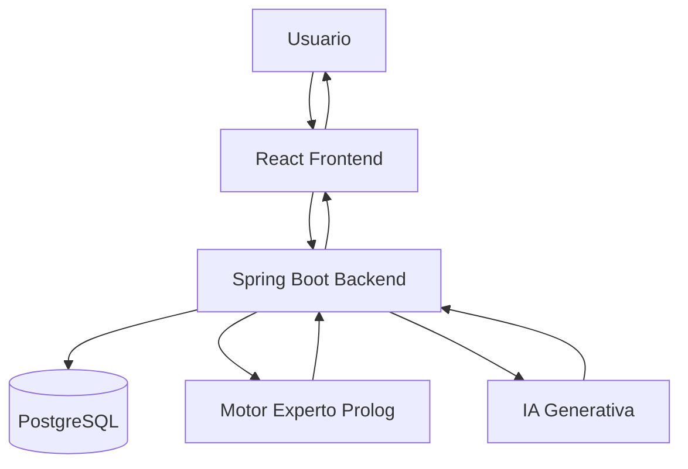
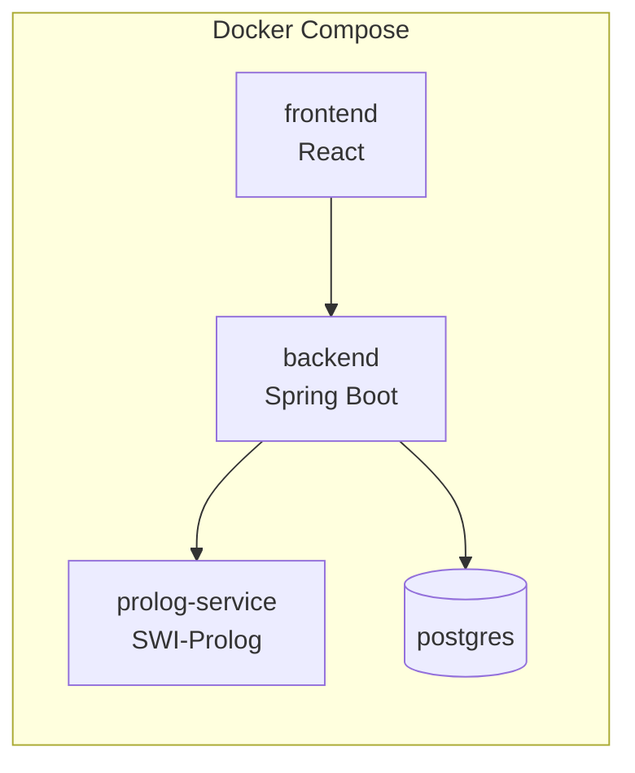
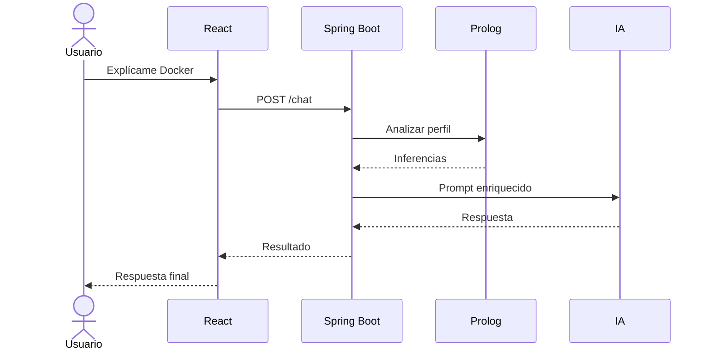

# Sistema Experto para Personalización Inteligente de Prompts mediante IA y Prolog

## Trabajo Final - Conceptos y Paradigmas de Programación

### Integrantes
- Lautaro Salvo Schafer
- Gerardo Loza

---

# 1. Introducción

## Problema

Las herramientas de Inteligencia Artificial generativa suelen recibir prompts incompletos o ambiguos.

Ejemplos:

```text
Explícame Docker
```

```text
Ayudame con Programación Concurrente
```

```text
Quiero aprender Machine Learning
```

La calidad de la respuesta depende enormemente de la calidad del prompt.

Actualmente el usuario debe enriquecer manualmente sus consultas agregando contexto, experiencia previa, objetivos y preferencias.

El proyecto busca resolver este problema mediante un Sistema Experto que construya automáticamente contexto personalizado para enriquecer los prompts enviados a una IA.

---

# 2. Objetivo General

Desarrollar un sistema experto capaz de:

- Mantener un perfil dinámico del usuario.
- Inferir conocimientos, intereses y necesidades.
- Personalizar prompts automáticamente.
- Aprender progresivamente sobre el usuario.
- Explicar las decisiones tomadas.
- Integrarse con modelos de IA generativa.

---

# 3. Paradigmas Utilizados

## Paradigma Orientado a Objetos / Imperativo

Tecnología:

- Java
- Spring Boot

Responsabilidades:

- API REST
- Persistencia
- Gestión de usuarios
- Comunicación entre servicios
- Integración con IA

---

## Paradigma Lógico / Declarativo

Tecnología:

- SWI-Prolog

Responsabilidades:

- Base de conocimiento
- Reglas expertas
- Inferencia
- Deducción de intereses
- Recomendaciones
- Personalización de prompts

---

# 4. Arquitectura General

```text
React Frontend
        |
        v
Spring Boot Backend
        |
        +------> PostgreSQL
        |
        +------> Servicio Prolog
        |
        +------> IA Generativa
```



---

# 5. Arquitectura Docker Compose

Servicios:

1. frontend
2. backend
3. prolog-service
4. postgres

```yaml
services:

  frontend:
    build: ./frontend

  backend:
    build: ./backend

  prolog:
    build: ./prolog

  postgres:
    image: postgres:17
```


---

# 6. Flujo Principal

## Paso 1

Usuario escribe:

```text
Explícame Docker
```

## Paso 2

React envía la solicitud al backend.

## Paso 3

Spring obtiene el perfil del usuario.

## Paso 4

Spring consulta al motor experto Prolog.

## Paso 5

Prolog realiza inferencias.

## Paso 6

Spring construye un prompt enriquecido.

## Paso 7

El prompt es enviado a una IA.

## Paso 8

La respuesta vuelve al usuario.



---

# 7. Perfil Inteligente del Usuario

Cada usuario tendrá un perfil evolutivo.

Ejemplo:

```json
{
  "skills": [
    {
      "name":"Java",
      "level":8
    },
    {
      "name":"Spring",
      "level":7
    },
    {
      "name":"Docker",
      "level":2
    }
  ]
}
```

---

# 8. Evolución Dinámica del Perfil

Después de cada aprendizaje:

```text
¿Desea actualizar su nivel en Docker?
```

Escala:

- 1 Novato
- 2 Básico
- 3 Intermedio
- 4 Avanzado
- 5 Experto

Esto permite que el perfil crezca continuamente.

---

# 9. Concepto de Skill

Una skill representa un conocimiento específico.

Ejemplos:

- Java
- Spring Boot
- Docker
- Kubernetes
- SQL
- Redes
- Machine Learning

Cada skill posee:

- Nivel
- Confianza
- Fecha de actualización

---
Deberiamos utilizar parametros de prompt y que tengan mas prioridad? por ej, si en el prompt el usuario pide, "*quiero que me expliques docker como le preguntarias a un experto*" entonces no importa si en tu perfil tenes un nivel inicial o intermedio, el prompt enriquecido no puede perder el pedido explicito de parte del usuario de ser tratado como experto. 
# 10. Confianza del Conocimiento

No todo conocimiento tiene la misma confiabilidad.

Ejemplo:

```text
Java
Nivel: 8
Confianza: 95%
```

```text
Docker
Nivel: 6
Confianza: 30%
```

La confianza se calcula utilizando:

- Autoevaluaciones
- Cantidad de consultas
- Tiempo de estudio
- Evaluaciones futuras

---

# 11. Sistema Experto

El núcleo del proyecto es Prolog.

Ejemplo:

```prolog
skill(java,8).
skill(spring,7).
skill(docker,2).
```

---

# 12. Reglas de Inferencia

## Perfil Backend

```prolog
backend_developer :-
    skill(java,N),
    N >= 7,
    skill(spring,S),
    S >= 7.
```

---

## Necesidad de Docker

```prolog
necesita_docker :-
    backend_developer,
    skill(docker,D),
    D < 4.
```

---

## Usar ejemplos Java

```prolog
usar_ejemplos_java :-
    backend_developer.
```

---

# 13. Detección de Intereses

Prolog puede descubrir intereses automáticamente.

```prolog
interes(devops) :-
    conoce(docker),
    conoce(kubernetes),
    conoce(ci_cd).
```

---

# 14. Recomendación de Aprendizaje

```prolog
deberia_aprender(devops_basico) :-
    skill(java,N),
    N > 7,
    skill(docker,D),
    D < 4.
```

---

# 15. Personalización de Prompts

Entrada:

```text
Explícame Docker
```

Prompt enriquecido:

```text
Explica Docker a un estudiante de sistemas.

Posee experiencia avanzada en Java y Spring Boot.

Utiliza ejemplos relacionados con APIs REST.

Evita definiciones básicas de programación.
```

---

# 16. Explicabilidad

El sistema mostrará por qué tomó cada decisión.

Ejemplo:

```text
Regla activada:
backend_developer
```

```text
Motivo:
Java >= 7
Spring >= 7
```

---

# 17. Historial de Aprendizaje

Se almacenará:

- Temas consultados
- Frecuencia
- Evolución temporal
- Skills desarrolladas

---

# 18. Dashboard del Usuario

## Información Personal

- Nombre
- Carrera
- Nivel

## Skills

- Java
- Spring
- Docker
- SQL

## Intereses Detectados

- Backend
- DevOps
- IA

---

# 19. Frontend React

Pantallas principales:

## Login

## Dashboard

## Chat Inteligente

## Perfil

## Historial

## Explicaciones del Sistema Experto

---

# 20. Chat Inteligente

Mientras la IA responde:

```text
Contexto aplicado:

✓ Perfil académico
✓ Experiencia Java
✓ Interés Backend
✓ Preferencia práctica
```

---

# 21. Backend Spring Boot

Capas:

```text
Controller
Service
Repository
Database
```

---

# 22. Endpoints

## Analizar Prompt

POST

```text
/api/prompts/analyze
```

## Generar Prompt

POST

```text
/api/prompts/generate
```

## Chat

POST

```text
/api/chat
```

## Actualizar Skill

POST

```text
/api/skills/update
```

## Obtener Perfil

GET

```text
/api/profile
```

---

# 23. Comunicación Spring-Prolog

Se realizará mediante HTTP REST.

Spring:

```text
POST http://prolog:8080/infer
```

Body:

```json
{
  "message":"Explicame Docker",
  "skills":{
    "java":8,
    "spring":7,
    "docker":2
  }
}
```

---

# 24. Respuesta de Prolog

```json
{
  "inferences":[
    "backend_developer",
    "usar_ejemplos_java",
    "necesita_docker"
  ]
}
```

---

# 25. Base de Datos PostgreSQL

Tablas sugeridas:

## users

## skills

## user_skills

## conversations

## inferences

## learning_history

---

# 26. Futuras Mejoras

- Evaluaciones automáticas.
- Gamificación.
- Sistema de logros.
- Rutas de aprendizaje.
- Recomendación de recursos.
- Integración con múltiples modelos IA.
- Generación automática de planes de estudio.

---

# 27. Justificación Académica

El proyecto demuestra:

## Paradigma Orientado a Objetos

- Spring Boot
- Capas
- Servicios
- APIs

## Paradigma Declarativo

- Prolog
- Reglas
- Inferencias

## Sistemas Distribuidos

- Docker Compose
- Servicios desacoplados

## Inteligencia Artificial

- Integración con LLMs

## Sistemas Expertos

- Base de conocimiento
- Motor de inferencia
- Explicabilidad

---

# 28. Conclusión

El sistema propuesto no es simplemente un chatbot.

Se trata de un Sistema Experto Inteligente capaz de construir un modelo dinámico del usuario, inferir conocimiento, detectar intereses, recomendar aprendizajes y enriquecer automáticamente prompts para maximizar la calidad de las respuestas generadas por modelos de Inteligencia Artificial.

La separación entre Spring Boot y Prolog permite demostrar claramente la combinación de paradigmas exigida por la materia, mientras que Docker Compose proporciona una arquitectura moderna, escalable y fácilmente desplegable.
