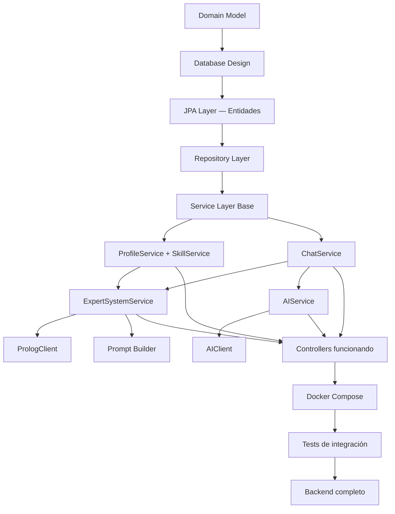

# 01 — Project Roadmap

**Proyecto:** Sistema Experto para Personalización Inteligente de Prompts  
**Rol:** Software Architect / Tech Lead  
**Fecha:** 2026-06-10  
**Fuentes:** `API_CONTRACT.md`, `ARCHITECTURE_DECISIONS.md`, `CONTROLLER_LAYER.md`

---

## Visión General

El backend es una API REST en Spring Boot que actúa como **orquestador central** del sistema. Coordina tres fuentes de datos y dos servicios externos:

```
React Frontend
      │
      ▼
Spring Boot API  ──────►  PostgreSQL     (persistencia)
      │
      ├──────────────────►  SWI-Prolog   (inferencias)
      │
      └──────────────────►  AI Provider  (generación de texto)
```

Spring Boot es el único componente con acceso a la base de datos (ADR-006). Prolog y la IA son servicios externos sin estado propio. El valor académico reside en el pipeline de enriquecimiento, no en la IA.

---

## Dependencias entre Módulos



**Regla crítica:** ninguna capa puede implementarse sin que su dependencia inferior esté completa. Los controllers ya existen como esqueleto; se conectarán a los servicios a medida que estos se implementen.

---

## Orden Recomendado de Implementación

| Fase | Módulos | Justificación |
|---|---|---|
| **1 — Fundación de datos** | Domain Model → Database → JPA | Sin entidades no hay nada |
| **2 — Acceso a datos** | Repositories | Sobre entidades JPA |
| **3 — Lógica de negocio base** | ProfileService, SkillService, ChatService | Sin integraciones externas |
| **4 — Integración Prolog** | PrologClient, ExpertSystemService | Depende de perfil y chat |
| **5 — Integración IA** | AIClient, AIService | Depende de mensajes enriquecidos |
| **6 — Infraestructura** | Docker Compose, variables de entorno | Integra todos los servicios |
| **7 — Calidad** | Tests unitarios, de integración, de controllers | Valida todo el pipeline |

---

## Milestones

### M1 — Persistencia funcional
**Entregable:** La aplicación levanta, conecta a PostgreSQL y las tablas se crean via JPA.  
**Criterio de aceptación:** `./mvnw spring-boot:run` sin errores de contexto. Tablas visibles en la base de datos.  
**Incluye:** Domain model, database design, entidades JPA, repositories, `application.properties`.

### M2 — API básica funcional
**Entregable:** Los endpoints de perfil, skills y chats devuelven datos reales desde PostgreSQL.  
**Criterio de aceptación:** `GET /api/profile`, `GET /api/skills`, `POST /api/chats` y `GET /api/chats/{id}` responden con datos de la base de datos.  
**Incluye:** `ProfileService`, `SkillService`, `ChatService` conectados a los controllers.

### M3 — Sistema experto funcionando
**Entregable:** `POST /api/chats/{chatId}/messages/enrich` devuelve un prompt enriquecido real usando Prolog.  
**Criterio de aceptación:** El mensaje se persiste en la base de datos con `appliedInferences` y `enrichedPrompt` correctos.  
**Incluye:** `PrologClient`, `ExpertSystemService`, `PromptBuilder`.

### M4 — Pipeline completo
**Entregable:** El flujo completo funciona end-to-end desde el frontend.  
**Criterio de aceptación:** Un usuario puede enriquecer un prompt y enviarlo a la IA. La respuesta se persiste y se devuelve.  
**Incluye:** `AIClient`, `AIService`.

### M5 — Producción lista
**Entregable:** Todo el sistema corre en Docker Compose con un solo `docker compose up`.  
**Criterio de aceptación:** Frontend, backend, Prolog y PostgreSQL levantados y comunicados correctamente.  
**Incluye:** Docker Compose, variables de entorno, healthchecks.

### M6 — Calidad garantizada
**Entregable:** Suite de tests que valida las capas críticas del sistema.  
**Criterio de aceptación:** `./mvnw test` pasa sin errores. Cobertura mínima en servicios y controllers.  
**Incluye:** Unit tests, integration tests, controller tests con MockMvc.

---

## Entregables por Documento

| Documento | Entregables Java | Entregables SQL |
|---|---|---|
| `02-domain-model.md` | Diseño conceptual de entidades | — |
| `03-database-design.md` | — | Scripts DDL conceptuales |
| `04-jpa-layer.md` | `User`, `Skill`, `UserSkill`, `Chat`, `Message` | — |
| `05-repository-layer.md` | `UserRepository`, `SkillRepository`, `UserSkillRepository`, `ChatRepository`, `MessageRepository` | — |
| `06-service-layer.md` | `ProfileService`, `SkillService`, `ChatService`, `ExpertSystemService`, `AIService` | — |
| `07-prolog-integration.md` | `PrologClient`, `PrologRequest`, `PrologResponse` | — |
| `08-prompt-enrichment-flow.md` | `PromptBuilder` | — |
| `09-docker-compose-architecture.md` | `application.properties` (perfiles) | — |
| `10-testing-strategy.md` | Tests por capa | — |
| `11-implementation-order.md` | Guía paso a paso | — |

---

## Estado Actual de Implementación

*Última actualización: 2026-06-10.*

| Capa / Componente | Estado | Notas |
|---|---|---|
| `application.properties` (base, dev, prod) | ✅ Implementado | Tres archivos con perfiles separados |
| Enum `EducationLevel` | ✅ Implementado | Paquete `enums` |
| Enum `SkillCategory` | ✅ Implementado | Valores: `BACKEND, FRONTEND, DATABASE, DEVOPS, CLOUD, PROGRAMMING_LANGUAGE, OTHER` |
| `StringListConverter` | ✅ Implementado | Paquete `converter` |
| Entidades JPA (`User`, `Skill`, `UserSkill`, `Chat`, `Message`) | ✅ Implementado | `Skill.category` es `SkillCategory` con `@Enumerated(EnumType.STRING)` |
| Repositorios (`UserRepository`, `SkillRepository`, `UserSkillRepository`, `ChatRepository`, `MessageRepository`) | ✅ Implementado | `ChatRepository.findChatsWithMessageCount` devuelve `ChatSummaryProjection` (projection tipada) |
| Excepciones de dominio (`ResourceNotFoundException`, `ConflictException`, `ExternalServiceException`) | ✅ Implementado | Paquete `exception` |
| `GlobalExceptionHandler` | ✅ Implementado | `@RestControllerAdvice`; cubre los 3 dominios + `MethodArgumentNotValidException` (400) + `Exception` (500) |
| `ProfileService` | ✅ Implementado | `getProfile` + `updateSkillLevel` con upsert |
| `SkillService` | ✅ Implementado | `getAllSkills(String)` parsea a `SkillCategory` con `toUpperCase`; valor inválido → lanza `IllegalArgumentException` → 400 Bad Request |
| `GlobalExceptionHandler` | ✅ Implementado | Cubre: `ResourceNotFoundException` (404), `ConflictException` (409), `ExternalServiceException` (503), `IllegalArgumentException` (400), `MethodArgumentNotValidException` (400), `Exception` (500) |
| `ChatService` | ✅ Implementado | CRUD completo con ownership y mapeo desde `ChatSummaryProjection` |
| Controllers (`Profile`, `Skill`, `Chat`, `ExpertSystem`, `AI`) | ⚠️ Esqueleto | Existen con mocks; pendiente conectarlos a los servicios (PASO 8 del roadmap) |
| `ExpertSystemService`, `PromptBuilder`, `PrologClient` | ⏳ Pendiente | PASOS 9–11 |
| `AIService`, `AIClient` | ⏳ Pendiente | PASOS 12–13 |
| `data.sql` seed | ⏳ Pendiente | PASO 15. Debe usar nombres del enum en mayúsculas (`'BACKEND'`, etc.) |
| Actuator | ⏳ Pendiente | PASO 16 |
| Tests (unit / controller / repository) | ⏳ Pendiente | PASOS 17–19 |
| Docker Compose | ⏳ Pendiente | PASO 20 |

> El roadmap histórico se mantiene intacto en `11-implementation-order.md`. Esta tabla refleja el estado del código en `prompt.expert_backend/src/main/java/...` al momento de la última actualización.

---

## Riesgos y Mitigaciones

| Riesgo | Probabilidad | Mitigación |
|---|---|---|
| springdoc 2.x incompatible con Spring Boot 4.x | Media | Usar swagger-annotations directamente si el Swagger UI no levanta |
| Prolog no disponible en desarrollo local | Alta | Implementar `MockPrologClient` para desarrollo sin el servicio Prolog |
| API de IA con rate limiting o latencia alta | Media | Implementar `MockAIClient` para tests; timeout configurable |
| `messageCount` desincronizado | Baja | Calcularlo con COUNT en query, no como campo almacenado |

---

*Siguiente documento: `02-domain-model.md`*
