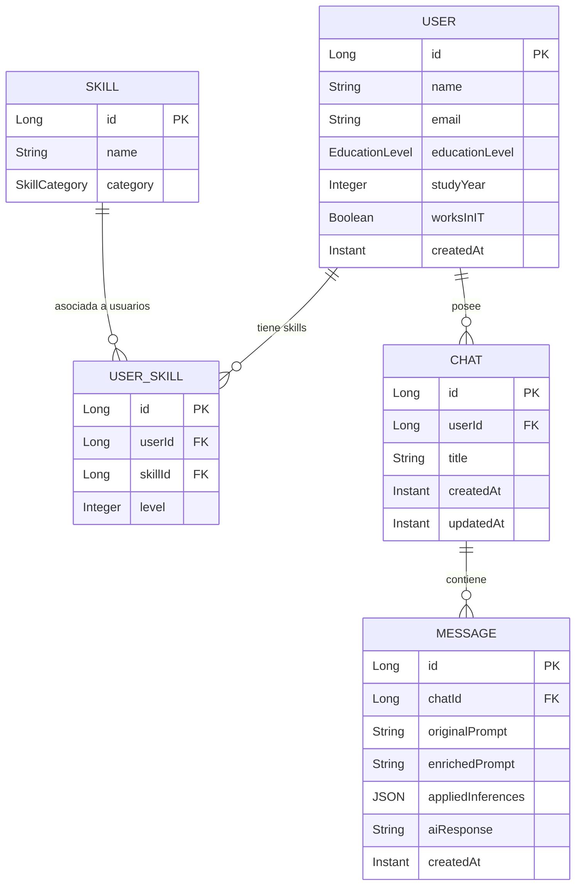
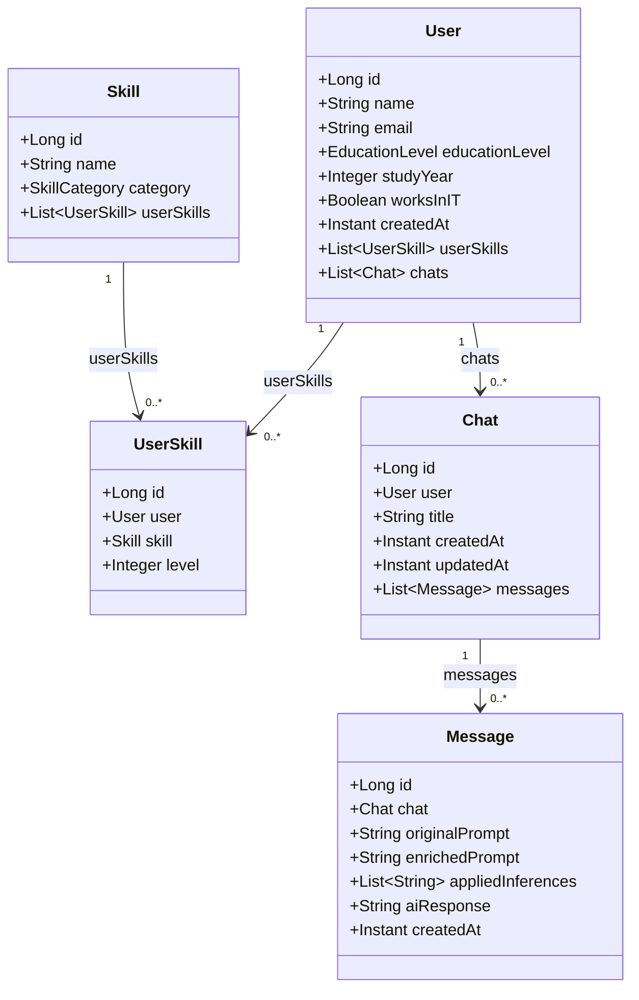

# 02 — Domain Model

**Fuentes:** `API_CONTRACT.md` §7, `ARCHITECTURE_DECISIONS.md` ADR-004

---

## Diagrama de Entidades (Conceptual)



---

## Entidades

### `User`

Representa al usuario del sistema. Es la entidad raíz de toda la jerarquía de datos.

| Atributo | Tipo Java | Nullable | Descripción |
|---|---|---|---|
| `id` | `Long` | No | PK autoincremental |
| `name` | `String` | No | Nombre del usuario |
| `email` | `String` | No | Email único |
| `educationLevel` | `EducationLevel` | No | Enum: nivel de educación |
| `studyYear` | `Integer` | Sí | Año de cursada (solo para estudiantes) |
| `worksInIT` | `Boolean` | No | ¿Trabaja en IT? |
| `createdAt` | `Instant` | No | Fecha de creación (gestionada por JPA) |

**Reglas de negocio:**
- `email` debe ser único en la base de datos.
- `studyYear` solo tiene valor cuando `educationLevel` ∈ `{SECONDARY_STUDENT, TERTIARY_STUDENT, UNIVERSITY_STUDENT}`. En cualquier otro caso es `null`.
- `createdAt` se asigna una única vez al persistir, nunca se modifica.

---

### `Skill`

Catálogo global de tecnologías y conocimientos disponibles en el sistema. No pertenece a ningún usuario en particular.

| Atributo | Tipo Java | Nullable | Descripción |
|---|---|---|---|
| `id` | `Long` | No | PK autoincremental |
| `name` | `String` | No | Nombre de la skill (ej: "Java") |
| `category` | `SkillCategory` | No | Enum cerrado. Persistido como STRING. |

**Enum `SkillCategory`** (paquete `enums`):

```
BACKEND, FRONTEND, DATABASE, DEVOPS, CLOUD, PROGRAMMING_LANGUAGE, OTHER
```

**Reglas de negocio:**
- `name` debe ser único.
- `category` es un conjunto cerrado de valores; no se permiten categorías arbitrarias. Agregar una nueva categoría requiere modificar el enum.
- El catálogo de skills es administrado por el sistema, no por el usuario.
- El usuario no puede crear skills, solo asociarlas a su perfil y actualizar su nivel.

---

### `UserSkill`

Entidad de asociación entre `User` y `Skill`. Es una entidad explícita (no un simple `@ManyToMany`) porque tiene el atributo adicional `level`.

| Atributo | Tipo Java | Nullable | Descripción |
|---|---|---|---|
| `id` | `Long` | No | PK autoincremental |
| `user` | `User` | No | FK → users.id |
| `skill` | `Skill` | No | FK → skills.id |
| `level` | `Integer` | No | Nivel de conocimiento (1–10) |

**Reglas de negocio:**
- La combinación `(userId, skillId)` debe ser única: un usuario no puede tener la misma skill dos veces.
- `level` debe estar en el rango `[1, 10]`. La validación ocurre en el DTO (`@Min(1)`, `@Max(10)`), pero también debe validarse en la capa de servicio antes de persistir.
- La categorización semántica del nivel (básico/intermedio/avanzado) es responsabilidad del sistema experto Prolog, no de esta entidad.

---

### `Chat`

Representa una conversación del usuario. Agrupa mensajes relacionados temáticamente.

| Atributo | Tipo Java | Nullable | Descripción |
|---|---|---|---|
| `id` | `Long` | No | PK autoincremental |
| `user` | `User` | No | FK → users.id |
| `title` | `String` | No | Título del chat |
| `createdAt` | `Instant` | No | Fecha de creación |
| `updatedAt` | `Instant` | No | Fecha de última modificación |

**Reglas de negocio:**
- `createdAt` se asigna al crear, nunca se modifica.
- `updatedAt` se actualiza en dos situaciones: cuando se renombra el chat y cuando se agrega un nuevo mensaje.
- Al eliminar un `Chat`, todos sus `Message` deben eliminarse en cascada (orphanRemoval).
- `messageCount` no se almacena como campo. Se calcula via `COUNT` en la consulta al listar chats, para evitar desincronización.

---

### `Message`

Entidad central del sistema. Almacena el ciclo de vida completo de una interacción: prompt original → inferencias → prompt enriquecido → respuesta IA.

| Atributo | Tipo Java | Nullable | Descripción |
|---|---|---|---|
| `id` | `Long` | No | PK autoincremental |
| `chat` | `Chat` | No | FK → chats.id |
| `originalPrompt` | `String` | No | Prompt tal como lo escribió el usuario |
| `enrichedPrompt` | `String` | No | Prompt enriquecido por el sistema experto |
| `appliedInferences` | `List<String>` | No | Inferencias aplicadas por Prolog (JSON array) |
| `aiResponse` | `String` | Sí | Respuesta del modelo de IA (null hasta que se envía) |
| `createdAt` | `Instant` | No | Fecha de creación |

**Reglas de negocio:**
- `originalPrompt` y `enrichedPrompt` se persisten juntos en la misma transacción al llamar a `POST /enrich`. Nunca se modifica ninguno de los dos después de creado.
- `appliedInferences` se persiste como un array JSON. Permite reconstruir el razonamiento completo del sistema experto (trazabilidad, ADR-004).
- `aiResponse` comienza en `null`. Solo se populiza al llamar a `POST /messages/{id}/send` o `POST /messages/{id}/retry`.
- `POST /send` falla con `409 Conflict` si `aiResponse` ya tiene valor. `POST /retry` siempre sobrescribe.
- `createdAt` se asigna al persistir, nunca se modifica.
- Al llamar a `POST /enrich`, `updatedAt` del `Chat` padre debe actualizarse en la misma transacción.

---

## Diagrama JPA Conceptual



---

## Relaciones Resumen

| Relación | Tipo | Cascada | Fetch |
|---|---|---|---|
| `User` → `Chat` | `@OneToMany` | `CascadeType.ALL`, orphanRemoval | LAZY |
| `Chat` → `Message` | `@OneToMany` | `CascadeType.ALL`, orphanRemoval | LAZY |
| `User` → `UserSkill` | `@OneToMany` | `CascadeType.ALL`, orphanRemoval | LAZY |
| `Skill` → `UserSkill` | `@OneToMany` | Sin cascada | LAZY |
| `UserSkill` → `User` | `@ManyToOne` | — | EAGER |
| `UserSkill` → `Skill` | `@ManyToOne` | — | EAGER |
| `Message` → `Chat` | `@ManyToOne` | — | LAZY |
| `Chat` → `User` | `@ManyToOne` | — | LAZY |

**Nota sobre `appliedInferences`:** se almacena como columna `TEXT` con un `AttributeConverter` que serializa/deserializa `List<String>` a/desde JSON usando Jackson. Alternativa: `@ElementCollection` con tabla separada. Se recomienda el converter por simplicidad de consulta.

---

*Siguiente documento: `03-database-design.md`*
