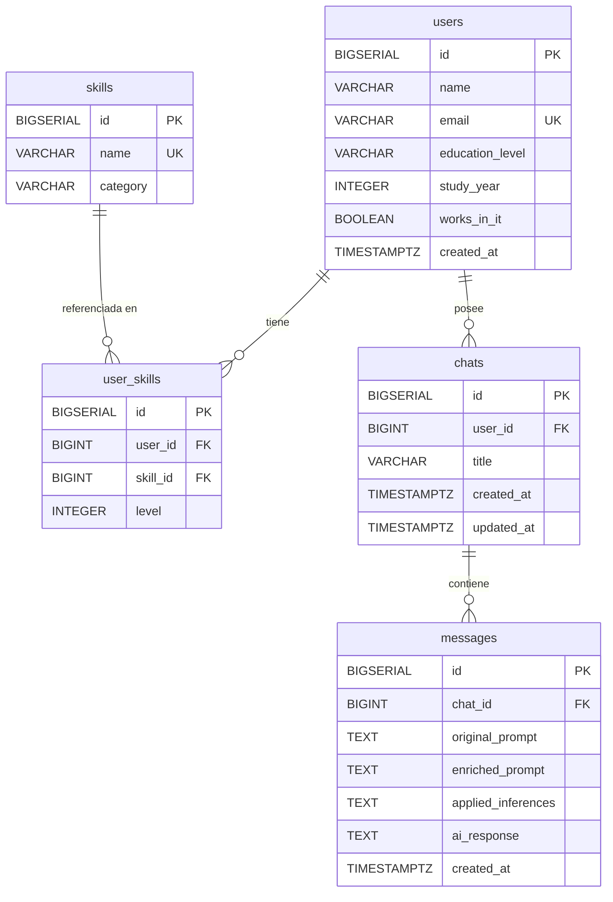

# 03 — Database Design

**Motor:** PostgreSQL 16+  
**Fuente:** `02-domain-model.md`, `API_CONTRACT.md`

---

## MER Completo



---

## Tablas

### `users`

| Columna | Tipo PostgreSQL | Nullable | Descripción |
|---|---|---|---|
| `id` | `BIGSERIAL` | No | PK autoincremental |
| `name` | `VARCHAR(255)` | No | Nombre del usuario |
| `email` | `VARCHAR(255)` | No | Email único |
| `education_level` | `VARCHAR(50)` | No | Valor del enum `EducationLevel` |
| `study_year` | `INTEGER` | Sí | Año de cursada (1–6) |
| `works_in_it` | `BOOLEAN` | No | ¿Trabaja en IT? |
| `created_at` | `TIMESTAMPTZ` | No | Timestamp con zona UTC |

**Constraints:**
- `PRIMARY KEY (id)`
- `UNIQUE (email)`
- `CHECK (study_year IS NULL OR (study_year >= 1 AND study_year <= 6))`
- `CHECK (education_level IN ('SECONDARY_STUDENT','TERTIARY_STUDENT','UNIVERSITY_STUDENT','GRADUATED','POSTGRADUATE'))`

---

### `skills`

| Columna | Tipo PostgreSQL | Nullable | Descripción |
|---|---|---|---|
| `id` | `BIGSERIAL` | No | PK autoincremental |
| `name` | `VARCHAR(100)` | No | Nombre de la skill |
| `category` | `VARCHAR(50)` | No | Valor del enum `SkillCategory` |

**Constraints:**
- `PRIMARY KEY (id)`
- `UNIQUE (name)`
- `CHECK (category IN ('BACKEND','FRONTEND','DATABASE','DEVOPS','CLOUD','PROGRAMMING_LANGUAGE','OTHER'))`

---

### `user_skills`

| Columna | Tipo PostgreSQL | Nullable | Descripción |
|---|---|---|---|
| `id` | `BIGSERIAL` | No | PK autoincremental |
| `user_id` | `BIGINT` | No | FK → `users.id` |
| `skill_id` | `BIGINT` | No | FK → `skills.id` |
| `level` | `INTEGER` | No | Nivel de conocimiento (1–10) |

**Constraints:**
- `PRIMARY KEY (id)`
- `FOREIGN KEY (user_id) REFERENCES users(id) ON DELETE CASCADE`
- `FOREIGN KEY (skill_id) REFERENCES skills(id) ON DELETE RESTRICT`
- `UNIQUE (user_id, skill_id)` — un usuario no puede tener la misma skill dos veces
- `CHECK (level >= 1 AND level <= 10)`

**Decisión de diseño:** se usa `BIGSERIAL id` como PK en lugar de una PK compuesta `(user_id, skill_id)` para simplificar el manejo desde JPA con `@IdClass` o `@EmbeddedId`. La constraint `UNIQUE (user_id, skill_id)` garantiza la unicidad de igual manera.

---

### `chats`

| Columna | Tipo PostgreSQL | Nullable | Descripción |
|---|---|---|---|
| `id` | `BIGSERIAL` | No | PK autoincremental |
| `user_id` | `BIGINT` | No | FK → `users.id` |
| `title` | `VARCHAR(255)` | No | Título del chat |
| `created_at` | `TIMESTAMPTZ` | No | Fecha de creación |
| `updated_at` | `TIMESTAMPTZ` | No | Fecha de última modificación |

**Constraints:**
- `PRIMARY KEY (id)`
- `FOREIGN KEY (user_id) REFERENCES users(id) ON DELETE CASCADE`
- `CHECK (LENGTH(TRIM(title)) > 0)`

**Nota:** `message_count` no se almacena. Se calcula con `COUNT` al listar chats (`SELECT c.*, COUNT(m.id) FROM chats c LEFT JOIN messages m ON m.chat_id = c.id`).

---

### `messages`

| Columna | Tipo PostgreSQL | Nullable | Descripción |
|---|---|---|---|
| `id` | `BIGSERIAL` | No | PK autoincremental |
| `chat_id` | `BIGINT` | No | FK → `chats.id` |
| `original_prompt` | `TEXT` | No | Prompt original del usuario |
| `enriched_prompt` | `TEXT` | No | Prompt enriquecido por el sistema experto |
| `applied_inferences` | `TEXT` | No | JSON array de inferencias (ej: `["backend_developer","needs_docker"]`) |
| `ai_response` | `TEXT` | Sí | Respuesta del modelo de IA |
| `created_at` | `TIMESTAMPTZ` | No | Fecha de creación |

**Constraints:**
- `PRIMARY KEY (id)`
- `FOREIGN KEY (chat_id) REFERENCES chats(id) ON DELETE CASCADE`
- `CHECK (LENGTH(TRIM(original_prompt)) > 0)`

**Decisión sobre `applied_inferences`:** se almacena como `TEXT` con JSON array serializado, en lugar de `JSONB`, para máxima compatibilidad con el `AttributeConverter` de JPA. Si en el futuro se necesitan consultas sobre el contenido de las inferencias, migrar a `JSONB`.

**Decisión sobre `ai_response`:** `TEXT` sin límite de longitud. Las respuestas de modelos de IA pueden ser extensas y no tiene sentido truncarlas.

---

## Índices

| Tabla | Columnas | Tipo | Justificación |
|---|---|---|---|
| `users` | `email` | UNIQUE | Lookup por email en autenticación |
| `user_skills` | `user_id` | B-tree | Obtener todas las skills de un usuario |
| `user_skills` | `(user_id, skill_id)` | UNIQUE | Evitar duplicados |
| `chats` | `user_id` | B-tree | Listar chats de un usuario |
| `chats` | `updated_at DESC` | B-tree | Ordenar chats por actividad reciente |
| `messages` | `chat_id` | B-tree | Obtener mensajes de un chat |
| `messages` | `created_at ASC` | B-tree | Ordenar mensajes cronológicamente |

---

## Scripts DDL Conceptuales

> Estos scripts son de referencia para el diseño. En producción, la creación de tablas la gestiona **Flyway** o **Liquibase** (a definir), no `spring.jpa.hibernate.ddl-auto`.  
> Para desarrollo inicial, se puede usar `spring.jpa.hibernate.ddl-auto=create-drop` temporalmente.

```sql
-- ============================================================
-- TABLA: users
-- ============================================================
CREATE TABLE users (
    id            BIGSERIAL    PRIMARY KEY,
    name          VARCHAR(255) NOT NULL,
    email         VARCHAR(255) NOT NULL,
    education_level VARCHAR(50) NOT NULL,
    study_year    INTEGER,
    works_in_it   BOOLEAN      NOT NULL DEFAULT FALSE,
    created_at    TIMESTAMPTZ  NOT NULL DEFAULT NOW(),

    CONSTRAINT uq_users_email UNIQUE (email),
    CONSTRAINT chk_users_study_year
        CHECK (study_year IS NULL OR (study_year >= 1 AND study_year <= 6)),
    CONSTRAINT chk_users_education_level
        CHECK (education_level IN (
            'SECONDARY_STUDENT','TERTIARY_STUDENT','UNIVERSITY_STUDENT',
            'GRADUATED','POSTGRADUATE'
        ))
);

-- ============================================================
-- TABLA: skills
-- ============================================================
CREATE TABLE skills (
    id       BIGSERIAL    PRIMARY KEY,
    name     VARCHAR(100) NOT NULL,
    category VARCHAR(50)  NOT NULL,

    CONSTRAINT uq_skills_name UNIQUE (name),
    CONSTRAINT chk_skills_category
        CHECK (category IN (
            'BACKEND','FRONTEND','DATABASE','DEVOPS',
            'CLOUD','PROGRAMMING_LANGUAGE','OTHER'
        ))
);

-- ============================================================
-- TABLA: user_skills
-- ============================================================
CREATE TABLE user_skills (
    id       BIGSERIAL PRIMARY KEY,
    user_id  BIGINT    NOT NULL,
    skill_id BIGINT    NOT NULL,
    level    INTEGER   NOT NULL,

    CONSTRAINT fk_user_skills_user
        FOREIGN KEY (user_id) REFERENCES users(id) ON DELETE CASCADE,
    CONSTRAINT fk_user_skills_skill
        FOREIGN KEY (skill_id) REFERENCES skills(id) ON DELETE RESTRICT,
    CONSTRAINT uq_user_skills_pair UNIQUE (user_id, skill_id),
    CONSTRAINT chk_user_skills_level CHECK (level >= 1 AND level <= 10)
);

CREATE INDEX idx_user_skills_user_id ON user_skills(user_id);

-- ============================================================
-- TABLA: chats
-- ============================================================
CREATE TABLE chats (
    id         BIGSERIAL    PRIMARY KEY,
    user_id    BIGINT       NOT NULL,
    title      VARCHAR(255) NOT NULL,
    created_at TIMESTAMPTZ  NOT NULL DEFAULT NOW(),
    updated_at TIMESTAMPTZ  NOT NULL DEFAULT NOW(),

    CONSTRAINT fk_chats_user
        FOREIGN KEY (user_id) REFERENCES users(id) ON DELETE CASCADE,
    CONSTRAINT chk_chats_title CHECK (LENGTH(TRIM(title)) > 0)
);

CREATE INDEX idx_chats_user_id ON chats(user_id);
CREATE INDEX idx_chats_updated_at ON chats(updated_at DESC);

-- ============================================================
-- TABLA: messages
-- ============================================================
CREATE TABLE messages (
    id                  BIGSERIAL   PRIMARY KEY,
    chat_id             BIGINT      NOT NULL,
    original_prompt     TEXT        NOT NULL,
    enriched_prompt     TEXT        NOT NULL,
    applied_inferences  TEXT        NOT NULL,
    ai_response         TEXT,
    created_at          TIMESTAMPTZ NOT NULL DEFAULT NOW(),

    CONSTRAINT fk_messages_chat
        FOREIGN KEY (chat_id) REFERENCES chats(id) ON DELETE CASCADE,
    CONSTRAINT chk_messages_original_prompt CHECK (LENGTH(TRIM(original_prompt)) > 0)
);

CREATE INDEX idx_messages_chat_id ON messages(chat_id);
CREATE INDEX idx_messages_created_at ON messages(created_at ASC);
```

---

## Datos de Ejemplo (Seed)

Para desarrollo y testing, se recomienda un script de seed con:

- 1 usuario (`id=1`, `email=lautaro@example.com`, `educationLevel=UNIVERSITY_STUDENT`, `studyYear=3`, `worksInIT=true`)
- Skills del catálogo base: Java (backend), React (frontend), Docker (devops), Spring Boot (backend), PostgreSQL (backend), Python (backend), Kubernetes (devops), TypeScript (frontend)
- UserSkills del usuario de ejemplo: Java nivel 8, Docker nivel 2
- 1 chat de ejemplo con 1 mensaje completo

Este seed se puede implementar con un `data.sql` en `src/main/resources` que Spring Boot ejecuta al arrancar con el perfil `dev`.

---

## Estrategia de Migración

| Entorno | Estrategia DDL |
|---|---|
| `dev` | `spring.jpa.hibernate.ddl-auto=create-drop` + `data.sql` para seed |
| `test` | `spring.jpa.hibernate.ddl-auto=create-drop` (base de datos H2 o PostgreSQL de test) |
| `prod` | `spring.jpa.hibernate.ddl-auto=validate` + Flyway para migraciones versionadas |

---

*Siguiente documento: `04-jpa-layer.md`*
