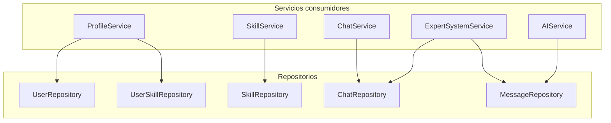

# 05 — Repository Layer

**Fuente:** `04-jpa-layer.md`, `API_CONTRACT.md`  
**Paquete:** `com.cyp.prompt.expert_backend.repository`  
**Framework:** Spring Data JPA

---

## Repositorios necesarios

```
repository/
├── UserRepository.java
├── SkillRepository.java
├── UserSkillRepository.java
├── ChatRepository.java
└── MessageRepository.java
```

Todos extienden `JpaRepository<T, Long>`, lo que provee automáticamente: `save`, `findById`, `findAll`, `deleteById`, `existsById`, `count`.

---

## `UserRepository`

**Entidad:** `User`  
**Consumidores:** `ProfileService`

### Responsabilidades

Gestionar la persistencia y recuperación de usuarios. En v1, el sistema asume un único usuario fijo (autenticación fuera de alcance). En la implementación, el `userId` se tomará de una constante o de un header hasta que se implemente autenticación.

### Consultas necesarias

| Método | Tipo | Descripción |
|---|---|---|
| `findById(Long id)` | Heredado | Obtener usuario por ID |
| `findByEmail(String email)` | Consulta derivada | Buscar usuario por email (para futura autenticación) |
| `existsByEmail(String email)` | Consulta derivada | Verificar si existe email (para validación) |

### Consultas derivadas Spring Data

```
Optional<User> findByEmail(String email)
boolean existsByEmail(String email)
```

Spring Data JPA genera automáticamente las queries a partir del nombre del método.

---

## `SkillRepository`

**Entidad:** `Skill`  
**Consumidores:** `SkillService`, `ProfileService`

### Responsabilidades

Acceder al catálogo global de skills. Las skills son de solo lectura para el usuario.

### Consultas necesarias

| Método | Tipo | Descripción |
|---|---|---|
| `findAll()` | Heredado | Listar todas las skills |
| `findByCategory(SkillCategory category)` | Consulta derivada | Filtrar por categoría |
| `findById(Long id)` | Heredado | Obtener skill por ID |
| `existsById(Long id)` | Heredado | Verificar que la skill existe antes de actualizar nivel |

### Consultas derivadas Spring Data

```
List<Skill> findByCategory(SkillCategory category)
```

> **Decisión:** `Skill.category` es un enum `SkillCategory` persistido como `@Enumerated(EnumType.STRING)`. Por lo tanto, `findByCategoryIgnoreCase` no es aplicable (Spring Data no soporta `IgnoreCase` sobre columnas mapeadas a enum). La tolerancia a mayúsculas/minúsculas del query param se resuelve en `SkillService`, parseando el `String` recibido a `SkillCategory` con `toUpperCase`.

---

## `UserSkillRepository`

**Entidad:** `UserSkill`  
**Consumidores:** `ProfileService`

### Responsabilidades

Gestionar la asociación usuario-skill y sus niveles de conocimiento.

### Consultas necesarias

| Método | Tipo | Descripción |
|---|---|---|
| `findByUserId(Long userId)` | Consulta derivada | Obtener todas las skills de un usuario |
| `findByUserIdAndSkillId(Long userId, Long skillId)` | Consulta derivada | Obtener relación específica usuario-skill |
| `existsByUserIdAndSkillId(Long userId, Long skillId)` | Consulta derivada | Verificar si el usuario ya tiene la skill |

### Consultas derivadas Spring Data

```
List<UserSkill> findByUserId(Long userId)
Optional<UserSkill> findByUserIdAndSkillId(Long userId, Long skillId)
boolean existsByUserIdAndSkillId(Long userId, Long skillId)
```

### Lógica de upsert en el servicio

El `ProfileService` al llamar `updateSkillLevel(userId, skillId, level)` debe:
1. Llamar `findByUserIdAndSkillId(userId, skillId)`.
2. Si existe: actualizar `level` y hacer `save`.
3. Si no existe: crear nuevo `UserSkill` y hacer `save`.

Esta lógica de **upsert** vive en el servicio, no en el repositorio.

---

## `ChatRepository`

**Entidad:** `Chat`  
**Consumidores:** `ChatService`, `ExpertSystemService`

### Responsabilidades

Persistencia y consulta de chats. Incluye la query más compleja del sistema: listar chats con conteo de mensajes.

### Consultas necesarias

| Método | Tipo | Descripción |
|---|---|---|
| `findByUserId(Long userId, Sort sort)` | Consulta derivada | Listar chats del usuario ordenados |
| `findByIdAndUserId(Long id, Long userId)` | Consulta derivada | Obtener chat verificando ownership |
| `findChatsWithMessageCount(Long userId)` | `@Query` JPQL | Lista con conteo de mensajes |

### Consultas derivadas Spring Data

```
List<Chat> findByUserId(Long userId, Sort sort)
Optional<Chat> findByIdAndUserId(Long chatId, Long userId)
```

### Query custom: `findChatsWithMessageCount`

Esta query es necesaria para responder `GET /api/chats` que devuelve `ChatResponse` con `messageCount`.

**Decisión:** se utiliza una **projection tipada** de Spring Data (`ChatSummaryProjection`) en lugar de devolver `List<Object[]>`.

Justificación:
- Evita el mapeo manual por índice (`row[0]` → `Chat`, `row[1]` → `Long`), que es frágil ante cambios en la query y propenso a errores de `ClassCastException`.
- La projection actúa como contrato explícito: cada getter corresponde a un alias del `SELECT`.
- El servicio recibe objetos legibles (`projection.getMessageCount()`) en lugar de un array sin nombre.
- Spring Data instancia automáticamente las implementaciones de la interfaz; no requiere clases adicionales.

**Definición:**

```java
interface ChatSummaryProjection {
    Long    getChatId();
    String  getTitle();
    Long    getMessageCount();
    Instant getCreatedAt();
    Instant getUpdatedAt();
}
```

**JPQL:**

```
SELECT c.id        AS chatId,
       c.title     AS title,
       COUNT(m)    AS messageCount,
       c.createdAt AS createdAt,
       c.updatedAt AS updatedAt
FROM Chat c
LEFT JOIN c.messages m
WHERE c.user.id = :userId
GROUP BY c.id, c.title, c.createdAt, c.updatedAt
ORDER BY c.updatedAt DESC
```

Los aliases (`AS chatId`, etc.) deben coincidir exactamente con los nombres de los getters del projection. El `LEFT JOIN` garantiza que un chat sin mensajes aparezca con `messageCount = 0`.

### Consideraciones

- Siempre verificar ownership (`findByIdAndUserId`) en lugar de `findById` para evitar que un usuario acceda a chats de otro.
- Al eliminar un chat (`deleteById`), la cascada JPA elimina los mensajes automáticamente gracias a `cascade = ALL, orphanRemoval = true`.

---

## `MessageRepository`

**Entidad:** `Message`  
**Consumidores:** `ExpertSystemService`, `AIService`

### Responsabilidades

Persistencia de mensajes. Los mensajes son inmutables en `originalPrompt` y `enrichedPrompt`; solo `aiResponse` se actualiza.

### Consultas necesarias

| Método | Tipo | Descripción |
|---|---|---|
| `findByChatIdOrderByCreatedAtAsc(Long chatId)` | Consulta derivada | Mensajes del chat en orden cronológico |
| `findById(Long id)` | Heredado | Obtener mensaje por ID (para `/send` y `/retry`) |
| `findByIdAndChatUserId(Long messageId, Long userId)` | Consulta derivada | Obtener mensaje verificando que pertenece al usuario |

### Consultas derivadas Spring Data

```
List<Message> findByChatIdOrderByCreatedAtAsc(Long chatId)
Optional<Message> findByIdAndChatUserId(Long messageId, Long userId)
```

La segunda query usa navegación de asociaciones de Spring Data: `findBy{entidad}.{relacion}.{campo}`.

### Consideraciones

- `findByIdAndChatUserId` garantiza que el usuario solo puede interactuar con sus propios mensajes, verificando la cadena `Message → Chat → User`.
- Al actualizar `aiResponse`, el servicio debe hacer `message.setAiResponse(response)` + `messageRepository.save(message)`. No se necesita una query de UPDATE explícita.
- Después de persistir un `Message`, el servicio debe actualizar `chat.setUpdatedAt(Instant.now())` para que el chat aparezca primero en el listado.

---

## Resumen de repositorios y sus queries



---

## Notas sobre transacciones

- Todos los métodos de escritura en servicios deben estar anotados con `@Transactional`.
- Los métodos de solo lectura deben usar `@Transactional(readOnly = true)` para optimizar el contexto de persistencia.
- Las queries con colecciones lazy (como `chat.getMessages()`) deben ejecutarse dentro de una transacción activa.
- En el `ExpertSystemService`, la persistencia del mensaje y la actualización del `updatedAt` del chat deben ocurrir en la **misma transacción**.

---

*Siguiente documento: `06-service-layer.md`*
