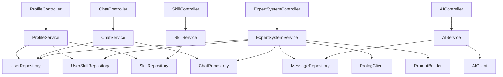

# 06 — Service Layer

**Fuente:** `API_CONTRACT.md`, `05-repository-layer.md`, `ARCHITECTURE_DECISIONS.md`  
**Paquete:** `com.cyp.prompt.expert_backend.service`  
**Patrón:** Los servicios son la única fuente de lógica de negocio. Los controllers llaman servicios. Los servicios llaman repositorios y clientes externos.

---

## Estructura de paquetes

```
service/
├── ProfileService.java
├── SkillService.java
├── ChatService.java
├── ExpertSystemService.java
└── AIService.java

client/
├── PrologClient.java          (interfaz)
├── PrologRestClient.java      (implementación HTTP)
├── MockPrologClient.java      (implementación mock para desarrollo)
├── AIClient.java              (interfaz)
├── ExternalAIClient.java      (implementación HTTP)
└── MockAIClient.java          (implementación mock para desarrollo)

exception/
├── ResourceNotFoundException.java
├── ConflictException.java
└── ExternalServiceException.java
```

---

## Excepciones de dominio

Antes de definir los servicios, se establecen las excepciones que estos lanzarán. Los controllers **no deben** contener lógica de manejo de errores; un `@ControllerAdvice` (`GlobalExceptionHandler`) las intercepta y transforma a `ErrorResponse`.

| Excepción | Código HTTP | Cuándo se lanza |
|---|---|---|
| `ResourceNotFoundException` | `404 Not Found` | Entidad no encontrada por ID |
| `ConflictException` | `409 Conflict` | Acción inválida sobre estado actual (ej: mensaje ya tiene aiResponse) |
| `ExternalServiceException` | `503 Service Unavailable` | Prolog o AI no disponibles |
| `jakarta.validation.ConstraintViolationException` | `400 Bad Request` | Validación fallida (manejada por Spring automáticamente) |

---

## `ProfileService`

**Dependencias:** `UserRepository`, `UserSkillRepository`, `SkillRepository`  
**Controller consumidor:** `ProfileController`

### Responsabilidades

- Obtener el perfil completo del usuario con sus skills.
- Actualizar el nivel de una skill del usuario (upsert).
- Mapear entidades a DTOs de respuesta.

### Métodos públicos

#### `getProfile(Long userId) → ProfileResponse`

```
1. Buscar User por ID → lanzar ResourceNotFoundException si no existe
2. Buscar List<UserSkill> por userId via UserSkillRepository
3. Mapear cada UserSkill a SkillResponse (skillId, name, level)
4. Construir y devolver ProfileResponse con todos los campos
```

**Transacciones:** `@Transactional(readOnly = true)`

#### `updateSkillLevel(Long userId, Long skillId, Integer level) → SkillResponse`

```
1. Verificar que el User existe → ResourceNotFoundException
2. Verificar que la Skill existe → ResourceNotFoundException
3. Buscar UserSkill por (userId, skillId) via UserSkillRepository
4. Si existe: actualizar level → save
5. Si no existe: crear nueva UserSkill → save
6. Mapear a SkillResponse y devolver
```

**Transacciones:** `@Transactional`  
**Nota:** el caso "crear nueva UserSkill" (paso 5) permite al usuario agregar una skill que no tenía. Si el diseño debe restringir esto (solo actualizar skills ya asociadas), agregar validación explícita en el paso 3.

---

## `SkillService`

**Dependencias:** `SkillRepository`  
**Controller consumidor:** `SkillController`

### Responsabilidades

- Proveer el catálogo global de skills.
- Filtrar por categoría si se proporciona.

### Métodos públicos

#### `getAllSkills(String category) → List<SkillCatalogResponse>`

```
1. Si category == null o blank: devolver SkillRepository.findAll()
2. Si category != null:
   a. Parsear el String a SkillCategory: SkillCategory.valueOf(category.trim().toUpperCase())
   b. Si el valor no corresponde a ningún enum (IllegalArgumentException):
      → lanzar IllegalArgumentException con mensaje descriptivo
      → el GlobalExceptionHandler la traduce a 400 Bad Request
      No interpretar como "sin resultados"; es un parámetro inválido del cliente.
   c. En caso contrario: SkillRepository.findByCategory(parsed)
3. Mapear cada Skill a SkillCatalogResponse (skillId, name, category)
```

> **Nota:** `Skill.category` es un `SkillCategory` (enum) persistido como STRING. El parseo case-insensitive se hace acá porque el repositorio recibe el enum tipado. Una categoría desconocida es un error del cliente (400), no una consulta vacía (200).

**Transacciones:** `@Transactional(readOnly = true)`

---

## `ChatService`

**Dependencias:** `ChatRepository`, `UserRepository`  
**Controller consumidor:** `ChatController`

### Responsabilidades

- CRUD completo de chats.
- Garantizar ownership: un usuario solo opera sobre sus propios chats.
- Calcular `messageCount` al listar chats.

### Métodos públicos

#### `createChat(Long userId, CreateChatRequest request) → ChatResponse`

```
1. Verificar que el User existe → ResourceNotFoundException
2. Construir nueva entidad Chat (user, title, createdAt=now, updatedAt=now)
3. Persistir via ChatRepository.save
4. Mapear a ChatResponse (messageCount=0)
```

**Transacciones:** `@Transactional`

#### `getChats(Long userId) → List<ChatResponse>`

```
1. Llamar ChatRepository.findChatsWithMessageCount(userId)
2. Mapear cada resultado a ChatResponse con messageCount
3. El orden viene dado por la query (updatedAt DESC)
```

**Transacciones:** `@Transactional(readOnly = true)`

#### `getChatById(Long userId, Long chatId) → ChatDetailResponse`

```
1. Buscar Chat por (chatId, userId) → ResourceNotFoundException
2. Buscar List<Message> ordenados cronológicamente via MessageRepository
3. Mapear cada Message a MessageResponse
4. Construir y devolver ChatDetailResponse con la lista de mensajes
```

**Transacciones:** `@Transactional(readOnly = true)`  
**Nota:** No cargar `chat.getMessages()` directamente (lazy); usar `MessageRepository.findByChatIdOrderByCreatedAtAsc`.

#### `renameChat(Long userId, Long chatId, RenameChatRequest request) → RenameChatResponse`

```
1. Buscar Chat por (chatId, userId) → ResourceNotFoundException
2. Actualizar chat.title
3. chat.updatedAt se actualiza automáticamente con @UpdateTimestamp
4. Persistir via ChatRepository.save
5. Mapear a RenameChatResponse
```

**Transacciones:** `@Transactional`

#### `deleteChat(Long userId, Long chatId) → void`

```
1. Buscar Chat por (chatId, userId) → ResourceNotFoundException
2. Llamar ChatRepository.delete(chat)
3. La cascada JPA elimina los mensajes automáticamente
```

**Transacciones:** `@Transactional`

---

## `ExpertSystemService`

**Dependencias:** `ChatRepository`, `MessageRepository`, `UserRepository`, `UserSkillRepository`, `PrologClient`, `PromptBuilder`  
**Controller consumidor:** `ExpertSystemController`

### Responsabilidades

- Orquestar el flujo de enriquecimiento (ADR-003, ADR-005).
- Recuperar perfil del usuario desde la base de datos.
- Delegar inferencias al servicio Prolog.
- Construir el prompt enriquecido con el resultado.
- Persistir el mensaje con `aiResponse = null`.
- Actualizar `updatedAt` del chat padre.

### Métodos públicos

#### `enrichPrompt(Long userId, Long chatId, EnrichPromptRequest request) → EnrichPromptResponse`

```
1. Verificar que el Chat existe y pertenece al userId → ResourceNotFoundException
2. Cargar el User con sus UserSkills via UserRepository + UserSkillRepository
3. Construir PrologRequest (prompt + userProfile) via PromptBuilder
4. Llamar PrologClient.infer(prologRequest) → PrologResponse
   → Si falla: lanzar ExternalServiceException (503)
5. Construir enrichedPrompt via PromptBuilder.buildEnrichedPrompt(prologResponse, userProfile, prompt)
6. Crear entidad Message:
   - originalPrompt = request.prompt()
   - enrichedPrompt = resultado del paso 5
   - appliedInferences = prologResponse.inferences()
   - aiResponse = null
   - chat = chat del paso 1
7. Persistir Message via MessageRepository.save
8. Actualizar chat.updatedAt = Instant.now() → ChatRepository.save
   (pasos 7 y 8 en la misma transacción @Transactional)
9. Mapear a EnrichPromptResponse y devolver
```

**Transacciones:** `@Transactional`  
**Nota crítica:** los pasos 7 y 8 deben estar en la misma transacción. Si el save de mensaje falla, el updatedAt no debe modificarse.

---

## `AIService`

**Dependencias:** `MessageRepository`, `AIClient`  
**Controller consumidor:** `AIController`

### Responsabilidades

- Enviar el `enrichedPrompt` de un mensaje al modelo de IA externo.
- Persistir la respuesta en el mensaje.
- Diferenciar entre `/send` (solo si `aiResponse == null`) y `/retry` (siempre sobrescribe).

### Métodos públicos

#### `sendMessage(Long userId, Long messageId) → SendMessageResponse`

```
1. Buscar Message por (messageId, userId via chat) → ResourceNotFoundException
2. Verificar que message.aiResponse == null
   → Si no es null: lanzar ConflictException (409)
3. Verificar que message.enrichedPrompt != null
   → Si es null: lanzar IllegalStateException / 400
4. Llamar AIClient.generate(message.enrichedPrompt)
   → Si falla: lanzar ExternalServiceException (503)
5. message.aiResponse = respuesta del paso 4
6. MessageRepository.save(message)
7. Devolver SendMessageResponse(messageId, aiResponse)
```

**Transacciones:** `@Transactional`

#### `retryMessage(Long userId, Long messageId) → SendMessageResponse`

```
1. Buscar Message por (messageId, userId via chat) → ResourceNotFoundException
2. (No verificar aiResponse — retry siempre sobrescribe)
3. Llamar AIClient.generate(message.enrichedPrompt)
   → Si falla: lanzar ExternalServiceException (503)
4. message.aiResponse = nueva respuesta
5. MessageRepository.save(message)
6. Devolver SendMessageResponse(messageId, aiResponse)
```

**Transacciones:** `@Transactional`

---

## `PromptBuilder`

**Paquete:** `service` (o `service.prompt`)  
**No es un `@Service` con dependencias externas, es una clase utilitaria.**

### Responsabilidades

- Construir el `PrologRequest` a partir del perfil del usuario y el prompt original.
- Construir el `enrichedPrompt` a partir de las inferencias de Prolog, el contexto adicional y el prompt original.

### Métodos

#### `buildPrologRequest(String prompt, User user, List<UserSkill> userSkills) → PrologRequest`

Mapea los datos del usuario a la estructura que espera el servicio Prolog.

#### `buildEnrichedPrompt(String originalPrompt, PrologResponse prologResponse, User user) → String`

Construye el texto del prompt enriquecido combinando:
- Contexto del usuario (nivel educativo, año, trabaja en IT)
- Inferencias de Prolog
- Recomendaciones de Prolog
- Contexto adicional de Prolog
- El prompt original al final

**Ejemplo de prompt enriquecido resultante:**

```
El usuario es estudiante universitario de tercer año que trabaja en IT.
Tiene nivel avanzado en Java (8/10) pero nivel inicial en Docker (2/10).
Inferencias aplicadas: backend_developer, needs_docker, use_java_examples.
Recomendaciones: Usar analogía con Maven para dependencias, incluir ejemplo con docker run.
Contexto adicional: Nivel principiante confirmado. Familiarizado con el ecosistema JVM.

Pregunta del usuario: Explícame Docker
```

La estructura exacta del prompt es responsabilidad de `PromptBuilder` y puede refinarse sin tocar otras capas.

---

## Diagrama de dependencias de servicios



---

## Convenciones generales para servicios

1. Los servicios nunca devuelven entidades JPA. Siempre mapean a DTOs.
2. El mapeo entidad → DTO puede hacerse con métodos privados dentro del servicio o con una clase `{Entidad}Mapper`. Para v1, métodos privados es suficiente.
3. `@Transactional(readOnly = true)` en todos los métodos de consulta para mejor performance.
4. Todo método que modifica estado lleva `@Transactional` sin `readOnly`.
5. Los servicios nunca capturan `RuntimeException` genéricas. Lanzar excepciones específicas para que el `GlobalExceptionHandler` las procese.

---

*Siguiente documento: `07-prolog-integration.md`*
