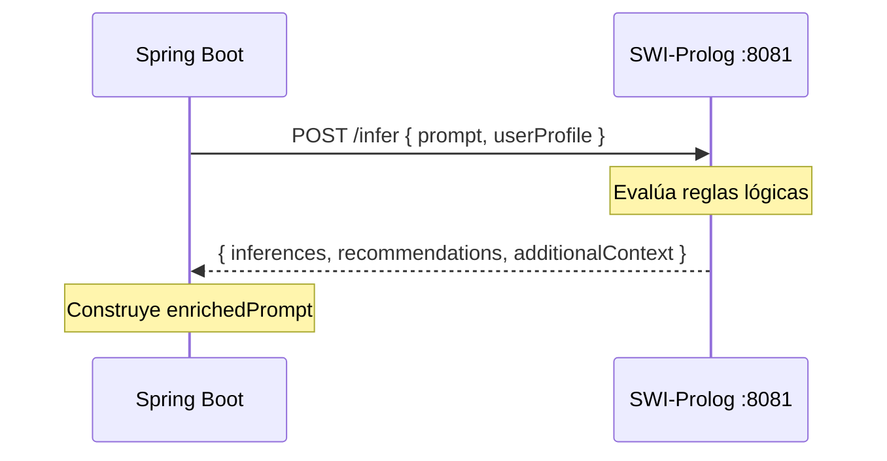
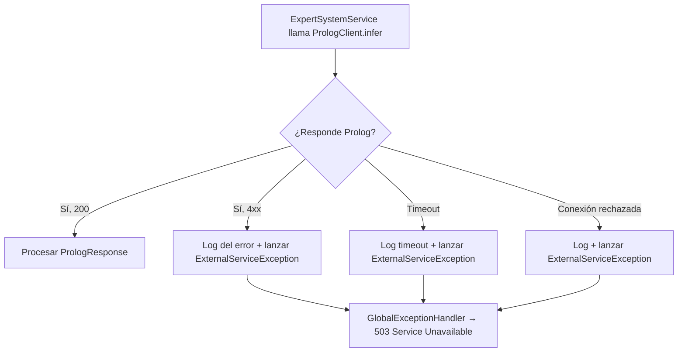

# 07 — Prolog Integration

**Fuente:** `ARCHITECTURE_DECISIONS.md` ADR-006, ADR-007, `API_CONTRACT.md` §9  
**Paquete:** `com.cyp.prompt.expert_backend.client`

---

## Visión General

Spring Boot actúa como **cliente HTTP** del servicio SWI-Prolog. Prolog expone un único endpoint REST (`POST /infer`) que recibe el perfil del usuario y el prompt, ejecuta las reglas de inferencia y devuelve el resultado.

**Principio clave (ADR-006):** Prolog nunca accede a PostgreSQL. Spring Boot es el único responsable de recuperar el perfil y enviárselo a Prolog como parte del request.



---

## Contrato del Endpoint Prolog

### `POST /infer`

**URL base:** configurada vía `prolog.service.base-url` en `application.properties`  
**URL completa:** `${prolog.service.base-url}/infer`

#### Request body

```json
{
  "prompt": "Explícame Docker",
  "userProfile": {
    "educationLevel": "UNIVERSITY_STUDENT",
    "studyYear": 3,
    "worksInIT": true,
    "skills": [
      { "name": "Java", "level": 8 },
      { "name": "Docker", "level": 2 }
    ]
  }
}
```

#### Response body `200 OK`

```json
{
  "inferences": [
    "backend_developer",
    "needs_docker",
    "use_java_examples"
  ],
  "recommendations": [
    "Usar analogía con máquinas virtuales",
    "Incluir ejemplo con docker run",
    "Contextualizar desde el ecosistema Java"
  ],
  "additionalContext": "Nivel principiante confirmado. Usuario familiarizado con Maven, se puede referenciar como analogía de gestión de dependencias."
}
```

---

## DTOs de Comunicación con Prolog

**Paquete:** `client.prolog`

### `PrologRequest`

Record que representa el body del request a Prolog.

| Campo | Tipo | Descripción |
|---|---|---|
| `prompt` | `String` | Prompt original del usuario |
| `userProfile` | `PrologUserProfile` | Perfil del usuario mapeado |

### `PrologUserProfile`

Record anidado dentro de `PrologRequest`.

| Campo | Tipo | Descripción |
|---|---|---|
| `educationLevel` | `String` | Valor del enum como String (ej: `"UNIVERSITY_STUDENT"`) |
| `studyYear` | `Integer` | Nullable |
| `worksInIT` | `boolean` | |
| `skills` | `List<PrologSkillEntry>` | Lista de skills con nivel |

### `PrologSkillEntry`

| Campo | Tipo | Descripción |
|---|---|---|
| `name` | `String` | Nombre de la skill |
| `level` | `int` | Nivel de conocimiento (1–10) |

### `PrologResponse`

Record que representa el body de la respuesta de Prolog.

| Campo | Tipo | Descripción |
|---|---|---|
| `inferences` | `List<String>` | Inferencias aplicadas (se persisten en `Message.appliedInferences`) |
| `recommendations` | `List<String>` | Recomendaciones de Prolog (usadas para construir el prompt enriquecido) |
| `additionalContext` | `String` | Contexto adicional para enriquecer el prompt |

---

## Interfaz `PrologClient`

**Paquete:** `client`

```
interface PrologClient {
    PrologResponse infer(PrologRequest request);
}
```

Esta interfaz permite tener múltiples implementaciones:
- `PrologRestClient`: implementación real con HTTP.
- `MockPrologClient`: implementación con respuesta fija para desarrollo local sin Prolog.

La implementación activa se selecciona por **Spring Profile** (`@Profile("prod")` vs `@Profile("dev")`).

---

## Implementación: `PrologRestClient`

**Tecnología:** `RestClient` (Spring 6.1+, disponible en Spring Boot 4.x)  
**Alternativa:** `WebClient` de Spring WebFlux si se prefiere reactividad.

### Configuración

```
Clase: PrologRestClientConfig (o inline en la implementación)
Bean: RestClient con baseUrl = ${prolog.service.base-url}
Timeout de conexión: configurable via ${prolog.service.connect-timeout-ms} (default: 3000ms)
Timeout de lectura: configurable via ${prolog.service.read-timeout-ms} (default: 10000ms)
```

### Comportamiento esperado

```
PrologRestClient.infer(PrologRequest request):
  1. Serializar request a JSON
  2. POST a ${prolog.service.base-url}/infer
  3. Si status 200: deserializar PrologResponse y devolver
  4. Si status 400: lanzar ExternalServiceException("Prolog rechazó el request: ...")
  5. Si status 5xx o timeout: lanzar ExternalServiceException("Servicio Prolog no disponible")
  6. Si IOException / conexión rechazada: lanzar ExternalServiceException("No se puede conectar a Prolog")
```

### Variables de entorno / application.properties

```properties
# Prolog Service
prolog.service.base-url=http://prolog:8081
prolog.service.connect-timeout-ms=3000
prolog.service.read-timeout-ms=10000
```

En Docker Compose, `prolog` es el nombre del servicio. En desarrollo local sin Docker, usar `http://localhost:8081`.

---

## Implementación: `MockPrologClient`

Para desarrollo local sin el contenedor Prolog activo. Devuelve inferencias fijas basadas en los datos del perfil recibido.

```
MockPrologClient.infer(PrologRequest request):
  1. Extraer habilidades del request
  2. Generar inferencias mock basadas en las skills recibidas
     (ej: si hay "Java" con level>=7 → agregar "backend_developer")
     (ej: si hay "Docker" con level<=3 → agregar "needs_docker")
  3. Devolver PrologResponse con inferencias, recommendations y additionalContext mock
```

**Activación:** `@Profile("dev")` o `@ConditionalOnProperty(name="prolog.mock", havingValue="true")`

---

## Manejo de Errores



`ExternalServiceException` debe incluir el servicio que falló (`"prolog"` o `"ai"`) para generar mensajes de error descriptivos:

```json
{
  "status": 503,
  "error": "Service Unavailable",
  "message": "El servicio de inferencia Prolog no está disponible. Intente nuevamente.",
  "timestamp": "2026-06-10T14:30:00Z"
}
```

---

## Estrategia de resilencia (v1)

Para v1, la estrategia de resilencia es simple:

| Caso | Comportamiento |
|---|---|
| Prolog responde en < timeout | Flujo normal |
| Prolog tarda más que `read-timeout-ms` | `ExternalServiceException` → 503 |
| Prolog no disponible | `ExternalServiceException` → 503 |
| Prolog devuelve 4xx | `ExternalServiceException` → 503 con detalle |

**No se implementa en v1:** retry automático, circuit breaker (Resilience4j), fallback con prompt sin enriquecer. Estas estrategias quedan documentadas como trabajo futuro.

---

## Diagrama de paquetes del cliente Prolog

```
client/
├── PrologClient.java              ← interfaz
├── PrologRestClient.java          ← implementación HTTP (@Profile("prod") o default)
├── MockPrologClient.java          ← implementación mock (@Profile("dev"))
└── prolog/
    ├── PrologRequest.java         ← record
    ├── PrologUserProfile.java     ← record
    ├── PrologSkillEntry.java      ← record
    └── PrologResponse.java        ← record
```

---

## Mapeo: Entidades JPA → PrologRequest

Esta conversión ocurre en `PromptBuilder.buildPrologRequest(...)`:

```
User.educationLevel.name() → PrologUserProfile.educationLevel
User.studyYear              → PrologUserProfile.studyYear
User.worksInIT              → PrologUserProfile.worksInIT
UserSkill.skill.name        → PrologSkillEntry.name
UserSkill.level             → PrologSkillEntry.level
```

---

*Siguiente documento: `08-prompt-enrichment-flow.md`*
