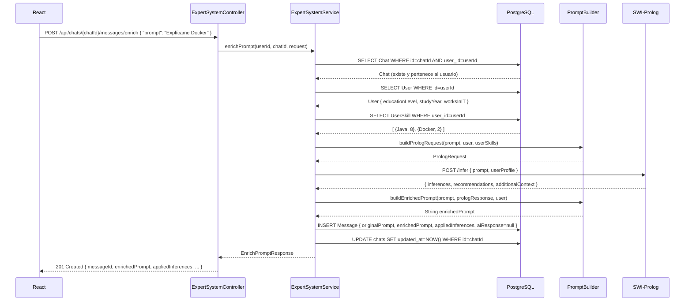
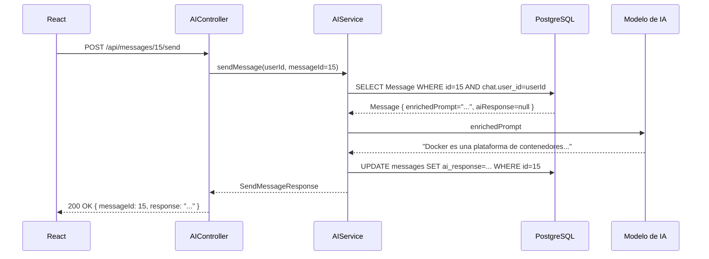
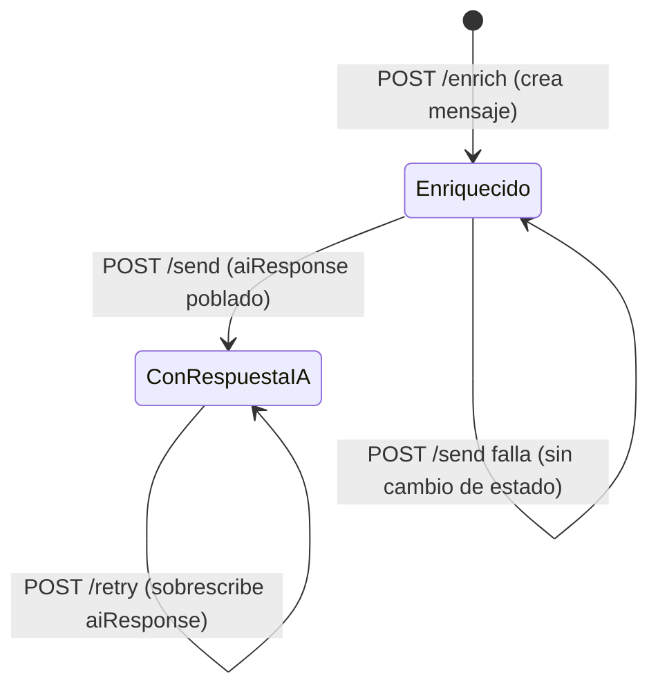

# 08 — Prompt Enrichment Flow

**Fuente:** `ARCHITECTURE_DECISIONS.md` ADR-001, ADR-003, ADR-004, ADR-005, ADR-008

---

## Visión General del Pipeline

Este es el flujo más importante del sistema. Transforma un prompt genérico en uno personalizado usando el perfil del usuario y las reglas de inferencia de Prolog.



---

## Paso a Paso Detallado

### Paso 1 — Recepción y validación del request

**Responsable:** `ExpertSystemController`

```
Request entrante:
  POST /api/chats/12/messages/enrich
  {
    "prompt": "Explícame Docker"
  }

Validaciones automáticas (Jakarta Validation):
  - prompt: @NotBlank → no vacío
  - prompt: @Size(max=4000) → no demasiado largo
  - chatId: Long → si no es numérico, Spring devuelve 400 automáticamente
```

Si la validación falla, Spring devuelve automáticamente `400 Bad Request` con los mensajes de error.

---

### Paso 2 — Verificación de contexto

**Responsable:** `ExpertSystemService`

```
ChatRepository.findByIdAndUserId(chatId=12, userId=1)
  → Si no existe: lanzar ResourceNotFoundException("Chat not found with id: 12")
  → Si existe: continuar con el Chat
```

Este paso garantiza que el usuario no puede enriquecer prompts en chats ajenos.

---

### Paso 3 — Carga del perfil del usuario

**Responsable:** `ExpertSystemService`

```
UserRepository.findById(userId=1)
  → User { id=1, name="Lautaro", educationLevel=UNIVERSITY_STUDENT, studyYear=3, worksInIT=true }

UserSkillRepository.findByUserId(userId=1)
  → [ UserSkill { skill={id=7, name="Java", category=BACKEND}, level=8 },
      UserSkill { skill={id=3, name="Docker", category=DEVOPS}, level=2 } ]
```

**Nota:** estas son dos queries separadas, no una query con JOIN, para evitar el problema N+1 en contextos de escritura.

---

### Paso 4 — Construcción del PrologRequest

**Responsable:** `PromptBuilder.buildPrologRequest`

```
Entrada:
  - prompt: "Explícame Docker"
  - user: { educationLevel=UNIVERSITY_STUDENT, studyYear=3, worksInIT=true }
  - userSkills: [ {Java, 8}, {Docker, 2} ]

Salida PrologRequest:
{
  "prompt": "Explícame Docker",
  "userProfile": {
    "educationLevel": "UNIVERSITY_STUDENT",
    "studyYear": 3,
    "worksInIT": true,
    "skills": [
      { "name": "Java", "level": 8 },
      { "name": "Docker", "level": 2 }
    ]
  }
}
```

---

### Paso 5 — Inferencia en Prolog

**Responsable:** `PrologRestClient.infer`

```
HTTP POST http://prolog:8081/infer
Body: PrologRequest del paso 4

Respuesta exitosa PrologResponse:
{
  "inferences": [
    "backend_developer",
    "needs_docker",
    "use_java_examples"
  ],
  "recommendations": [
    "Usar analogía con máquinas virtuales",
    "Incluir ejemplo con docker run",
    "Contextualizar desde el ecosistema Java"
  ],
  "additionalContext": "Nivel principiante confirmado. Usuario familiarizado con Maven,
                         se puede referenciar como analogía de gestión de dependencias."
}
```

**Si Prolog falla:** lanzar `ExternalServiceException` → `GlobalExceptionHandler` → `503 Service Unavailable`. No se persiste ningún mensaje en la base de datos.

---

### Paso 6 — Construcción del prompt enriquecido

**Responsable:** `PromptBuilder.buildEnrichedPrompt`

```
Entradas:
  - originalPrompt: "Explícame Docker"
  - prologResponse: { inferences, recommendations, additionalContext }
  - user: { educationLevel=UNIVERSITY_STUDENT, studyYear=3, worksInIT=true }
  - userSkills: [ {Java, 8}, {Docker, 2} ]

Algoritmo de construcción:
  1. Bloque de contexto del usuario
  2. Bloque de inferencias aplicadas
  3. Bloque de recomendaciones
  4. Contexto adicional de Prolog
  5. Prompt original del usuario al final
```

**Ejemplo de prompt enriquecido resultante:**

```
Contexto del usuario:
- Nivel educativo: Estudiante universitario, 3er año
- Trabaja en IT: Sí
- Habilidades relevantes: Java (nivel 8/10 — avanzado), Docker (nivel 2/10 — principiante)

Inferencias del sistema experto:
- Es desarrollador backend con experiencia en Java
- Necesita aprender Docker desde un enfoque backend
- Responder usando ejemplos de Java y el ecosistema JVM

Recomendaciones de presentación:
- Usar analogía con máquinas virtuales para introducir contenedores
- Incluir un ejemplo práctico con docker run
- Contextualizar desde la perspectiva del ecosistema Java/Maven

Contexto adicional: Nivel principiante confirmado. El usuario está familiarizado con Maven
como gestor de dependencias, lo cual puede usarse como analogía.

---
Pregunta del usuario: Explícame Docker
```

---

### Paso 7 — Persistencia del mensaje

**Responsable:** `ExpertSystemService` (transacción única)

```
Dentro de @Transactional:

  Message message = Message.builder()
      .chat(chat)
      .originalPrompt("Explícame Docker")
      .enrichedPrompt("Contexto del usuario: ...")
      .appliedInferences(["backend_developer","needs_docker","use_java_examples"])
      .aiResponse(null)
      .build();

  messageRepository.save(message);  → INSERT en messages con id=15

  chat.setUpdatedAt(Instant.now());
  chatRepository.save(chat);        → UPDATE chats SET updated_at=... WHERE id=12
```

Si cualquiera de las dos operaciones de persistencia falla, la transacción se revierte completamente.

---

### Paso 8 — Respuesta al frontend

**Responsable:** `ExpertSystemController`

```
HTTP 201 Created
{
  "messageId": 15,
  "chatId": 12,
  "originalPrompt": "Explícame Docker",
  "appliedInferences": [
    "backend_developer",
    "needs_docker",
    "use_java_examples"
  ],
  "enrichedPrompt": "Contexto del usuario: ...",
  "aiResponse": null,
  "createdAt": "2026-06-10T14:05:00Z"
}
```

El `messageId: 15` es el identificador que el frontend debe conservar para la siguiente llamada opcional a `POST /api/messages/15/send`.

---

## Flujo de envío a IA (continuación opcional)



---

## Estados de un mensaje



| Estado | `enrichedPrompt` | `aiResponse` | Acción permitida |
|---|---|---|---|
| Recién enriquecido | Presente | `null` | `/send` ✓ `/retry` (no aplica) |
| Con respuesta IA | Presente | Presente | `/send` → `409` / `/retry` ✓ |

---

## Manejo de errores en el flujo

| Paso | Error posible | Respuesta HTTP |
|---|---|---|
| 1 | Prompt vacío | `400 Bad Request` |
| 2 | Chat no encontrado / no pertenece al usuario | `404 Not Found` |
| 3 | Usuario no encontrado | `404 Not Found` |
| 5 | Prolog no disponible / timeout | `503 Service Unavailable` |
| 7 | Error de base de datos | `500 Internal Server Error` |

---

## Visibilidad del pipeline para el usuario (ADR-008)

Según ADR-008, el frontend debe mostrar el progreso en tiempo real. Las etapas visibles son:

```
1. [→] Enviando prompt...
2. [→] Obteniendo perfil del usuario...
3. [→] Ejecutando inferencias (Prolog)...
4. [→] Construyendo prompt enriquecido...
5. [✓] Prompt enriquecido listo
```

**Implementación sugerida en v1:** el frontend hace polling del estado o simplemente muestra el spinner durante la llamada, ya que `POST /enrich` es una operación síncrona. Para un pipeline de progreso en tiempo real, se necesitaría SSE (Server-Sent Events) o WebSocket, lo cual queda fuera del alcance v1.

---

*Siguiente documento: `09-docker-compose-architecture.md`*
