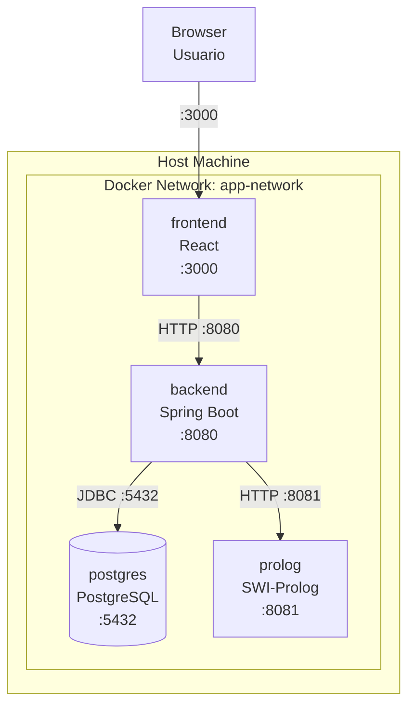
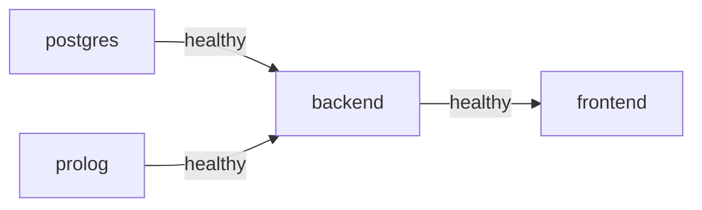

# 09 — Docker Compose Architecture

**Fuente:** `ARCHITECTURE_DECISIONS.md` ADR-007  
**Alcance:** diseño de la infraestructura de contenedores. No incluye Dockerfiles ni archivos de configuración finales.

---

## Visión General



---

## Servicios

### `frontend`

| Campo | Valor |
|---|---|
| **Imagen base** | `node:20-alpine` (build) + `nginx:alpine` (serve) |
| **Puerto host** | `3000` |
| **Puerto contenedor** | `80` (nginx) |
| **Build context** | `./prompt.expert_frontend` |
| **Dependencias** | `backend` debe estar healthy |

**Variables de entorno:**

```env
VITE_API_BASE_URL=http://localhost:8080/api
```

---

### `backend`

| Campo | Valor |
|---|---|
| **Imagen base** | `eclipse-temurin:21-jre-alpine` |
| **Puerto host** | `8080` |
| **Puerto contenedor** | `8080` |
| **Build context** | `./prompt.expert_backend` |
| **Dependencias** | `postgres` (healthy) + `prolog` (healthy) |

**Variables de entorno:**

```env
# Base de datos
SPRING_DATASOURCE_URL=jdbc:postgresql://postgres:5432/expert_prompts
SPRING_DATASOURCE_USERNAME=expert_user
SPRING_DATASOURCE_PASSWORD=expert_pass

# JPA
SPRING_JPA_HIBERNATE_DDL_AUTO=validate

# Prolog
PROLOG_SERVICE_BASE_URL=http://prolog:8081
PROLOG_SERVICE_CONNECT_TIMEOUT_MS=3000
PROLOG_SERVICE_READ_TIMEOUT_MS=10000

# AI Provider
AI_PROVIDER_BASE_URL=https://api.openai.com/v1
AI_PROVIDER_API_KEY=${AI_API_KEY}
AI_PROVIDER_MODEL=gpt-4o-mini

# Spring profile
SPRING_PROFILES_ACTIVE=prod
```

**Healthcheck:**

```
test: ["CMD", "curl", "-f", "http://localhost:8080/actuator/health"]
interval: 30s
timeout: 10s
retries: 5
start_period: 40s
```

> Requiere agregar `spring-boot-starter-actuator` al `pom.xml`.

---

### `postgres`

| Campo | Valor |
|---|---|
| **Imagen** | `postgres:16-alpine` |
| **Puerto host** | `5432` |
| **Puerto contenedor** | `5432` |
| **Volumen** | `postgres-data:/var/lib/postgresql/data` |

**Variables de entorno:**

```env
POSTGRES_DB=expert_prompts
POSTGRES_USER=expert_user
POSTGRES_PASSWORD=expert_pass
```

**Healthcheck:**

```
test: ["CMD-SHELL", "pg_isready -U expert_user -d expert_prompts"]
interval: 10s
timeout: 5s
retries: 5
```

---

### `prolog`

| Campo | Valor |
|---|---|
| **Imagen base** | `swipl:9-alpine` (o imagen custom con el servidor HTTP) |
| **Puerto host** | `8081` |
| **Puerto contenedor** | `8081` |
| **Build context** | `./prompt.expert_prolog` (directorio a crear) |

**Variables de entorno:**

```env
PROLOG_PORT=8081
```

**Healthcheck:**

```
test: ["CMD", "curl", "-f", "http://localhost:8081/health"]
interval: 15s
timeout: 5s
retries: 3
start_period: 10s
```

> El servidor HTTP de Prolog debe exponer `GET /health` que devuelve `200 OK` para el healthcheck.

---

## Redes

| Red | Tipo | Propósito |
|---|---|---|
| `app-network` | `bridge` | Red interna compartida por todos los contenedores |

**Comunicación entre servicios:** usando nombre de servicio como hostname (ej: `postgres`, `prolog`, `backend`). Docker Compose gestiona la resolución DNS interna.

**Comunicación con el host:** solo los puertos explícitamente mapeados son accesibles desde el host (`3000`, `8080`, `5432`). El puerto de Prolog (`8081`) puede no exponerse al host en producción.

---

## Volúmenes

| Volumen | Montado en | Propósito |
|---|---|---|
| `postgres-data` | `/var/lib/postgresql/data` | Persistencia de la base de datos entre reinicios |

**Volúmenes de desarrollo** (solo para perfil `dev`):

```yaml
# Solo en override para desarrollo:
backend:
  volumes:
    - ./prompt.expert_backend:/app  # hot reload con spring-boot-devtools
```

---

## Orden de arranque



Docker Compose respeta el orden definido en `depends_on` con `condition: service_healthy`.

---

## Perfiles de Spring Boot

| Perfil | Cuándo usarlo | `ddl-auto` | Prolog | IA |
|---|---|---|---|---|
| `dev` | Desarrollo local | `create-drop` | `MockPrologClient` | `MockAIClient` |
| `test` | Tests de integración | `create-drop` | `MockPrologClient` | `MockAIClient` |
| `prod` | Docker Compose / producción | `validate` | `PrologRestClient` | `ExternalAIClient` |

**Archivos de configuración:**

```
src/main/resources/
├── application.properties           ← valores comunes
├── application-dev.properties       ← sobreescrituras para dev
├── application-test.properties      ← sobreescrituras para test
└── application-prod.properties      ← sobreescrituras para prod (sin secretos)
```

Los secretos (`AI_API_KEY`, `SPRING_DATASOURCE_PASSWORD`) nunca deben estar en los archivos de configuración. Se inyectan como variables de entorno o a través de un archivo `.env` (no comitear `.env` al repositorio).

---

## Estructura de archivos Docker esperada

```
CYP-ExpertSystemPromptIA/
├── docker-compose.yml               ← orquestación principal
├── docker-compose.override.yml      ← sobreescrituras para desarrollo local
├── .env.example                     ← plantilla de variables de entorno (sin valores reales)
├── prompt.expert_frontend/
│   └── Dockerfile
├── prompt.expert_backend/
│   └── Dockerfile
└── prompt.expert_prolog/
    ├── Dockerfile
    └── server.pl                    ← servidor HTTP Prolog
```

---

## Variables de entorno — Referencia completa

| Variable | Servicio | Descripción | Valor ejemplo |
|---|---|---|---|
| `POSTGRES_DB` | postgres | Nombre de la base de datos | `expert_prompts` |
| `POSTGRES_USER` | postgres | Usuario de PostgreSQL | `expert_user` |
| `POSTGRES_PASSWORD` | postgres | Contraseña de PostgreSQL | *(secreto)* |
| `SPRING_DATASOURCE_URL` | backend | JDBC URL | `jdbc:postgresql://postgres:5432/expert_prompts` |
| `SPRING_DATASOURCE_USERNAME` | backend | Usuario DB | `expert_user` |
| `SPRING_DATASOURCE_PASSWORD` | backend | Contraseña DB | *(secreto)* |
| `SPRING_PROFILES_ACTIVE` | backend | Perfil activo | `prod` |
| `PROLOG_SERVICE_BASE_URL` | backend | URL del servicio Prolog | `http://prolog:8081` |
| `PROLOG_SERVICE_READ_TIMEOUT_MS` | backend | Timeout de lectura Prolog | `10000` |
| `AI_PROVIDER_BASE_URL` | backend | URL base de la API de IA | `https://api.openai.com/v1` |
| `AI_PROVIDER_API_KEY` | backend | API key de la IA | *(secreto)* |
| `AI_PROVIDER_MODEL` | backend | Modelo de IA a usar | `gpt-4o-mini` |
| `VITE_API_BASE_URL` | frontend | URL de la API backend | `http://localhost:8080/api` |
| `PROLOG_PORT` | prolog | Puerto del servidor Prolog | `8081` |

---

## Estado actual de la implementación (PASO 20 — base)

El diseño anterior describe el objetivo final (4 servicios). **Lo implementado hasta ahora** es la base con dos servicios:

| Servicio | Estado | Notas |
|---|---|---|
| `postgres` | ✅ implementado | `postgres:16-alpine`, volumen `postgres-data`, puerto `5432`, healthcheck `pg_isready` |
| `backend` | ✅ implementado | build multi-stage (`prompt.expert_backend/Dockerfile`), perfil `docker`, healthcheck `/actuator/health` |
| `prolog` | ⏳ siguiente paso | bloque ya preparado y comentado en `docker-compose.yml` |
| `frontend` | ⏳ pendiente | fuera del alcance de este paso |

**Diferencias con el perfil `prod`** (deliberadas, para que la base sea autocontenida):

- Perfil activo: `docker` (`application-docker.properties`), no `prod`.
- `ddl-auto=update` en vez de `validate`: Hibernate crea las tablas y el volumen las persiste (no hay migraciones aún).
- `prolog.mock` / `ai.mock` por defecto `true` (vía `PROLOG_MOCK` / `AI_MOCK`): el backend levanta sin depender de Prolog ni de un proveedor de IA.

**Archivos creados:** `docker-compose.yml`, `.env.example`, `.gitignore` (ignora `.env`), `prompt.expert_backend/Dockerfile`, `prompt.expert_backend/.dockerignore`, `prompt.expert_backend/src/main/resources/application-docker.properties`.

**Comandos:**

```bash
cp .env.example .env      # completar POSTGRES_PASSWORD
docker compose up --build # postgres + backend
docker compose down       # parar (-v borra el volumen de datos)
```

**Cómo agregar Prolog (siguiente paso):**

1. Crear `prompt.expert_prolog/` con `Dockerfile` + `server.pl` (servidor HTTP SWI-Prolog con `GET /health` y `POST /infer`).
2. Descomentar el servicio `prolog` en `docker-compose.yml` y la dependencia `prolog: condition: service_healthy` del backend.
3. Poner `PROLOG_MOCK=false` en `.env`. El backend pasa a usar `PrologRestClient` contra `http://prolog:8081` — sin cambios de código (el switch ya existe en `PrologClientConfig`).

---

*Siguiente documento: `10-testing-strategy.md`*
